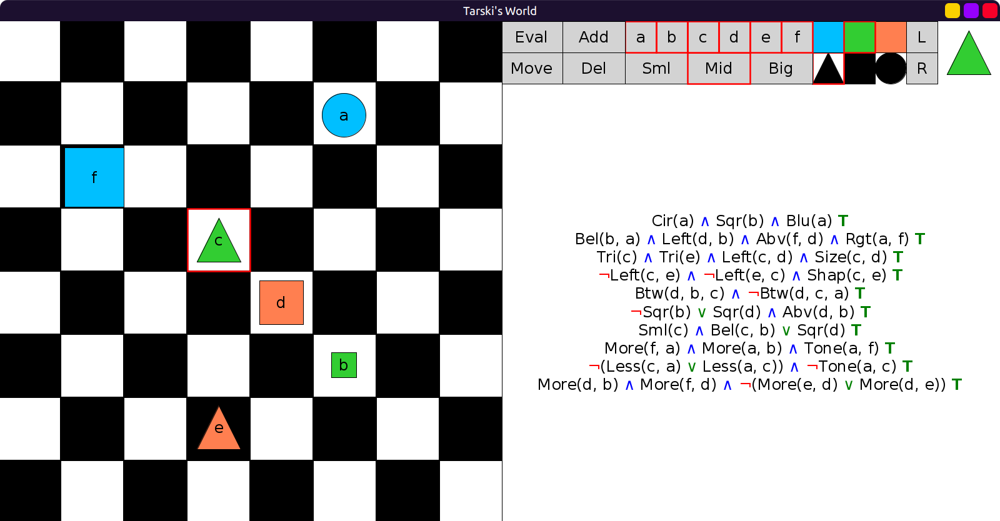

# 05 - solution

One possible solution:



Here is the grid for this solution:

```scala
val grid: Grid = Map(
  (1, 5) -> Block(Mid, Cir, Blu, "a"),
  (2, 1) -> Block(Big, Sqr, Blu, "f"),
  (3, 3) -> Block(Mid, Tri, Lim, "c"),
  (4, 4) -> Block(Mid, Sqr, Red, "d"),
  (5, 5) -> Block(Sml, Sqr, Lim, "b"),
  (6, 3) -> Block(Mid, Tri, Red, "e")
)
```

There are many other solutions.
