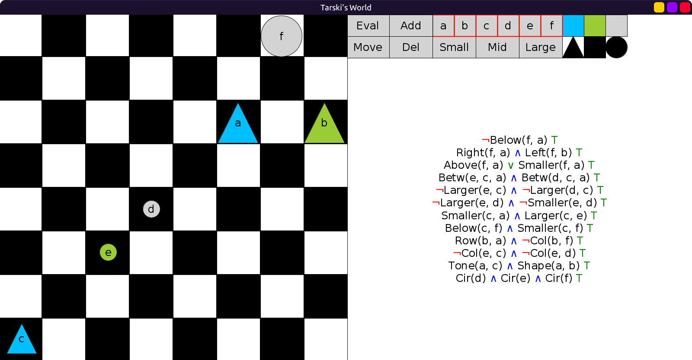
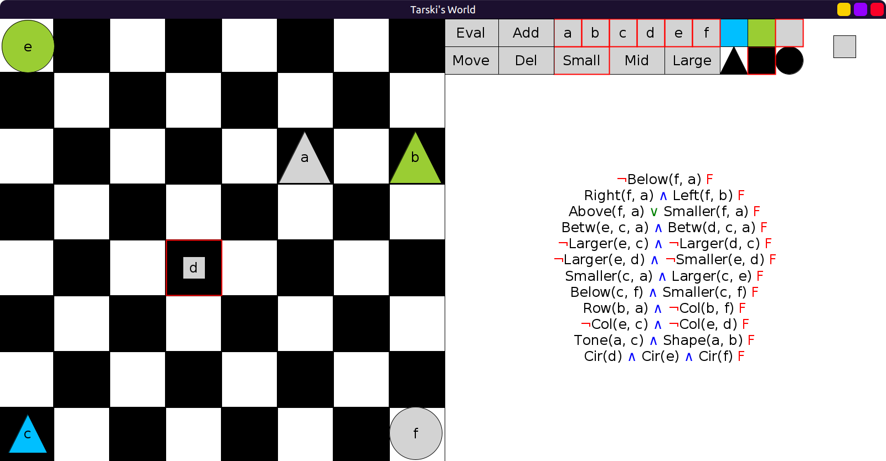

# 06 - Solution

Here are the sentences:

```scala
val sentences06 = Seq(
  fof"¬Bel(f, a)",
  fof"Rgt(f, a) ∧ Left(f, b)",
  fof"Abv(f, a) ∨ Less(f, a)",
  fof"Btw(e, c, a) ∧ Btw(d, c, a)",
  fof"¬More(e, c) ∧ ¬More(d, c)",
  fof"¬More(e, d) ∧ ¬Less(e, d)",
  fof"Less(c, a) ∧ More(c, e)",
  fof"Bel(c, f) ∧ Less(c, f)",
  fof"Row(b, a) ∧ ¬Col(b, f)",
  fof"¬Col(e, c) ∧ ¬Col(e, d)",
  fof"Tone(a, c) ∧ Shap(a, b)",
  fof"Cir(d) ∧ Cir(e) ∧ Cir(f)"
)
```

You can see they are all true:



Then we can change the world as described in the example, to make them all false:


