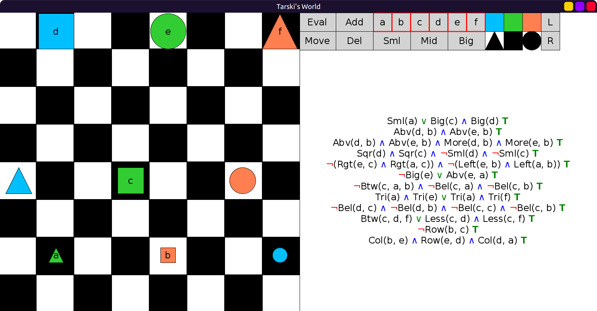
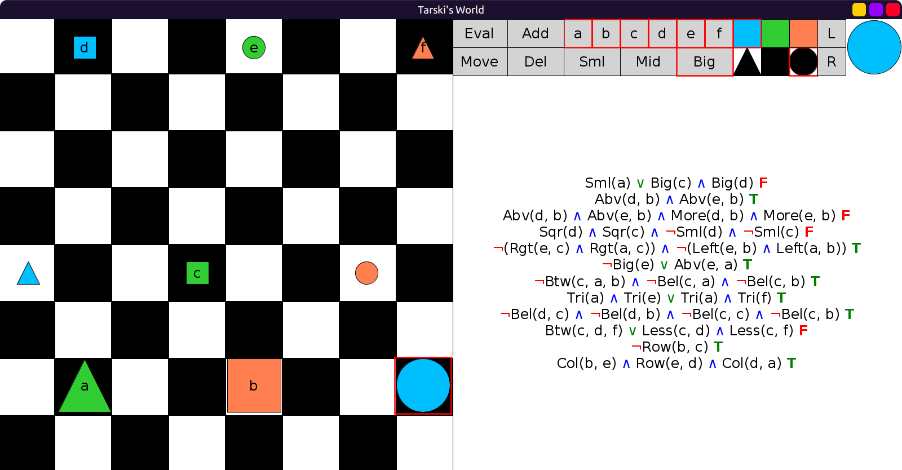
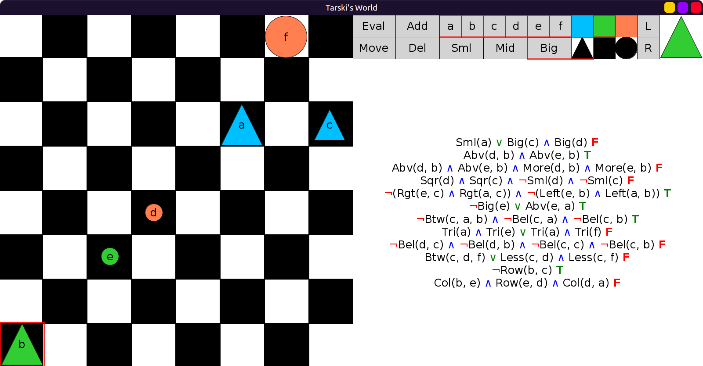

# 08 - Solution

Initial evaluation in `WittgensteinWorld`:

After modifying `WittgensteinWorld`:

After rotating `WittgensteinWorld` 90◦ clockwise:

Initial evaluation in `BooleWorld`, only 6 and 11 are true:

After modifying `BooleWorld`, 2, 5, 6, 7, 11 are true:

