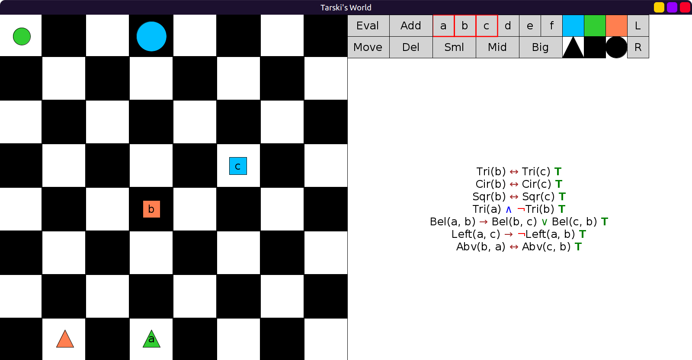

# 10 - Solution

Here is the solution:

```scala
val SherlockWorld: Grid = Map(
  (0, 0) -> Block(Sml, Cir, Lim),
  (0, 3) -> Block(Mid, Cir, Blu),
  (3, 5) -> Block(Sml, Sqr, Blu, "c"),
  (4, 3) -> Block(Sml, Sqr, Red, "b"),
  (7, 1) -> Block(Sml, Tri, Red),
  (7, 3) -> Block(Sml, Tri, Lim, "a")
)
```

After naming the objects:


