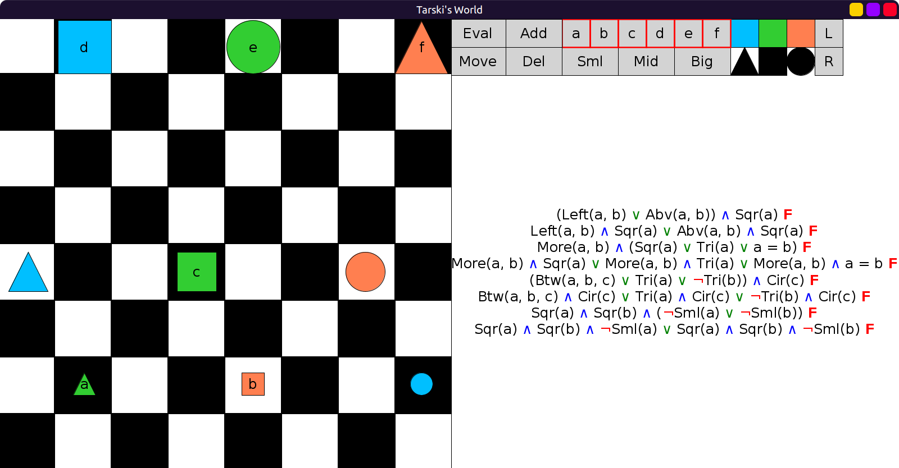
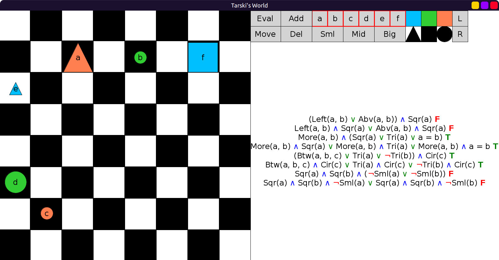
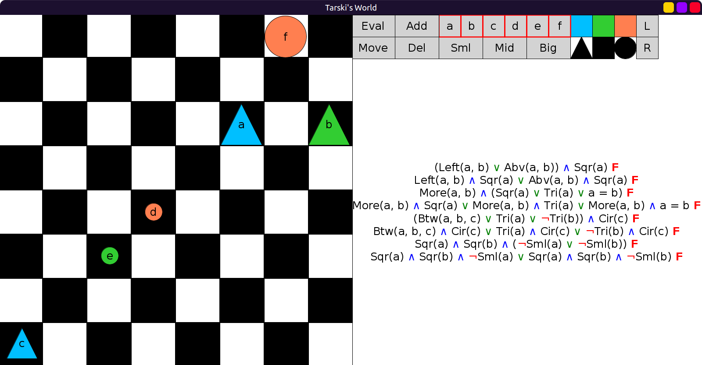

# 22 - solution

Here are the sentences with their disjunctive normal form equivalents:

```scala
val CNFSentences = Seq(
  fof"(Left(a, b) ∨ Abv(a, b)) ∧ Sqr(a)",
  fof"(Left(a, b) ∧ Sqr(a)) ∨ (Abv(a, b) ∧ Sqr(a))",
  fof"More(a, b) ∧ (Sqr(a) ∨ Tri(a) ∨ a = b)",
  fof"(More(a, b) ∧ Sqr(a)) ∨ (More(a, b) ∧ Tri(a)) ∨ (More(a, b) ∧ a = b)",
  fof"(Btw(a, b, c) ∨ Tri(a) ∨ ¬Tri(b)) ∧ Cir(c)",
  fof"(Btw(a, b, c) ∧ Cir(c)) ∨ (Tri(a) ∧ Cir(c)) ∨ (¬Tri(b) ∧ Cir(c))",
  fof"Sqr(a) ∧ Sqr(b) ∧ (¬Sml(a) ∨ ¬Sml(b))",
  fof"(Sqr(a) ∧ Sqr(b) ∧ ¬Sml(a)) ∨ (Sqr(a) ∧ Sqr(b) ∧ ¬Sml(b))"
)
```

Here are evaluations in 6 worlds:









