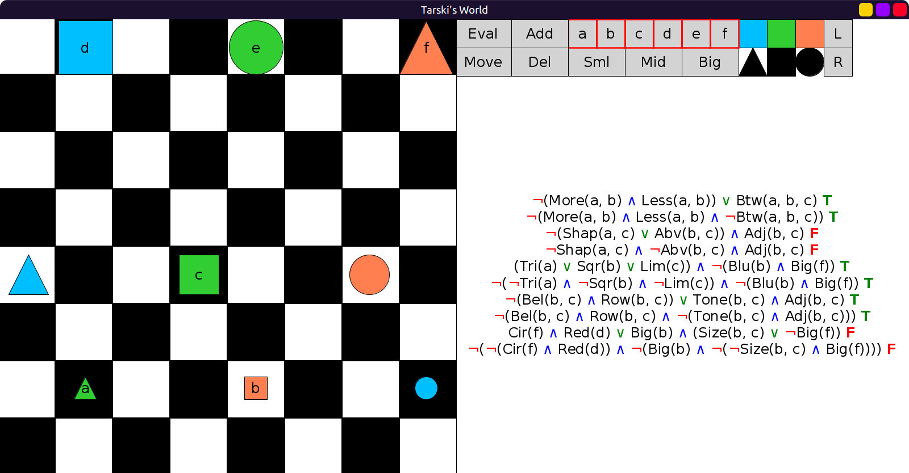
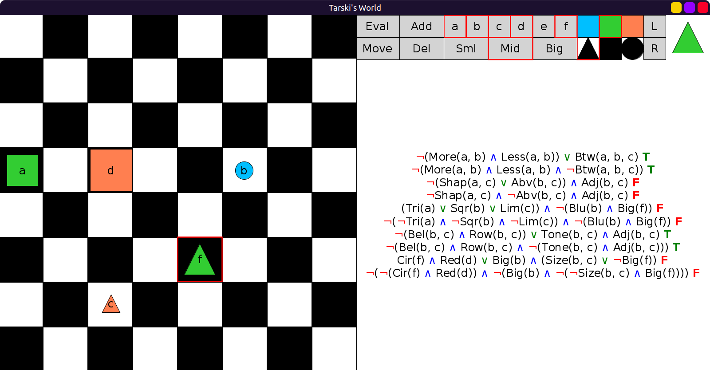

# 24 - solution

We simply use DeMorgan equivalences to eliminate the usages of `∨`.
If we encounter `A∨B` we can replace it with `¬(¬A ∧ ¬B)`.
And if we get double negations, we can eliminate them.
Here's what we get:

```scala
val GentzenSentences1 = Seq(
  fof"¬(More(a,b) ∧ Less(a,b)) ∨ Btw(a,b,c)",
  fof"¬((More(a,b) ∧ Less(a,b)) ∧ ¬Btw(a,b,c))",
  fof"¬(Shap(a,c) ∨ Abv(b,c)) ∧ Adj(b,c)",
  fof"(¬Shap(a,c) ∧ ¬Abv(b,c)) ∧ Adj(b,c)",
  fof"(Tri(a) ∨ Sqr(b) ∨ Lim(c)) ∧ ¬(Blu(b) ∧ Big(f))",
  fof"¬(¬Tri(a) ∧ ¬Sqr(b) ∧ ¬Lim(c)) ∧ ¬(Blu(b) ∧ Big(f))",
  fof"¬(Bel(b,c) ∧ Row(b,c)) ∨ (Tone(b,c) ∧ Adj(b,c))",
  fof"¬((Bel(b,c) ∧ Row(b,c)) ∧ ¬(Tone(b,c) ∧ Adj(b,c)))",
  fof"(Cir(f) ∧ Red(d)) ∨ (Big(b) ∧ (Size(b,c) ∨ ¬Big(f)))",
  fof"¬(¬(Cir(f) ∧ Red(d)) ∧ ¬(Big(b) ∧ ¬(¬Size(b,c) ∧ Big(f))))"
)
```

Evaluations in six worlds, we always gets the same results in pairs (TT, FF):




Here there was no block with label `f`, so I added a block with label `f`:



Similarly, here I chose one of the unnamed blocks and added the label `f` to it:


