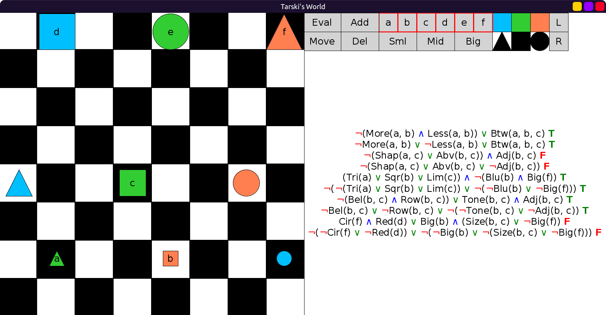
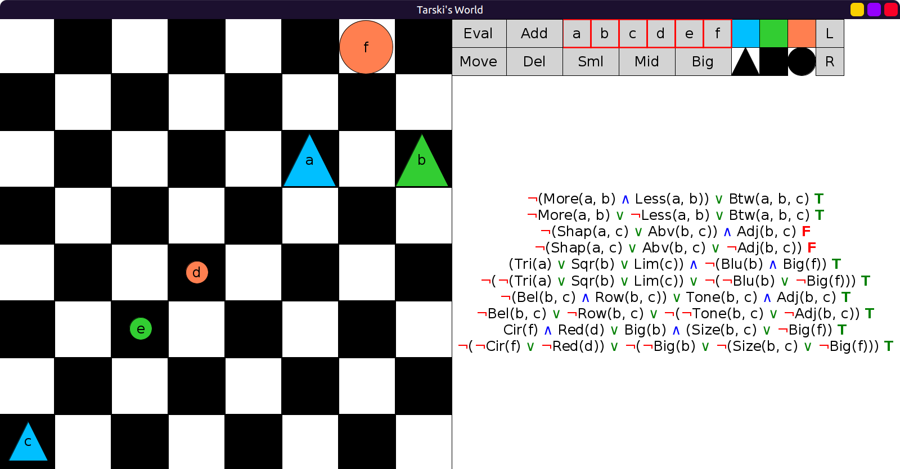

# 25 - solution

Similar to 24, we can use DeMorgan equivalence to eliminate `∧`.
When we see `A∧B` we can replace it with `¬(¬A ∨ ¬B)`,
and we eliminate any double negations we come across:

```scala
val GentzenSentences2 = Seq(
  fof"¬(More(a,b) ∧ Less(a,b)) ∨ Btw(a,b,c)",
  fof"(¬More(a,b) ∨ ¬Less(a,b)) ∨ Btw(a,b,c)",
  fof"¬(Shap(a,c) ∨ Abv(b,c)) ∧ Adj(b,c)",
  fof"¬((Shap(a,c) ∨ Abv(b,c)) ∨ ¬Adj(b,c))",
  fof"(Tri(a) ∨ Sqr(b) ∨ Lim(c)) ∧ ¬(Blu(b) ∧ Big(f))",
  fof"¬(¬(Tri(a) ∨ Sqr(b) ∨ Lim(c)) ∨ ¬(¬Blu(b) ∨ ¬Big(f)))",
  fof"¬(Bel(b,c) ∧ Row(b,c)) ∨ (Tone(b,c) ∧ Adj(b,c))",
  fof"(¬Bel(b,c) ∨ ¬Row(b,c)) ∨ ¬(¬Tone(b,c) ∨ ¬Adj(b,c))",
  fof"(Cir(f) ∧ Red(d)) ∨ (Big(b) ∧ (Size(b,c) ∨ ¬Big(f)))",
  fof"¬(¬Cir(f) ∨ ¬Red(d)) ∨ ¬(¬Big(b) ∨ ¬(Size(b,c) ∨ ¬Big(f)))",
)
```

Evaluations in six worlds, we always gets the same results in pairs (TT, FF):






Here there was no block with label `f`, so I added a block with label `f`:


Similarly, here I chose one of the unnamed blocks and added the label `f` to it:


