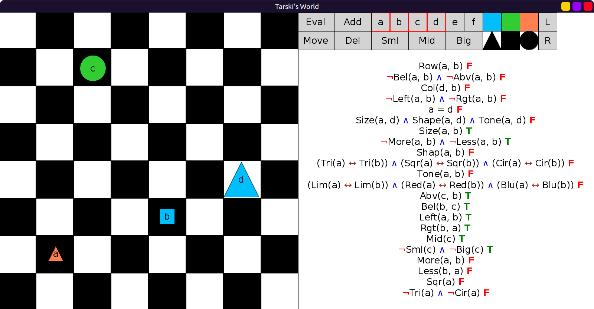
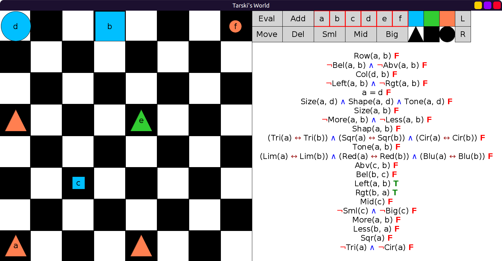

# 26 - solution

Many of these have multiple solutions:

```scala
val BernaysSentences = Seq(
  fof"Row(a,b)",
  fof"¬Bel(a,b) ∧ ¬Abv(a,b)", // also ¬Bel(a,b) ∧ ¬Bel(b,a), or ¬Abv(b,a) ∧ ¬Abv(a,b)
  fof"Col(d,b)",
  fof"¬Left(a,b) ∧ ¬Rgt(a,b)", // also ¬Left(a,b) ∧ ¬Left(b,a), or ¬Rgt(a,b) ∧ ¬Rgt(b,a)
  fof"a = d",
  fof"Size(a,d) ∧ Shape(a,d) ∧ Tone(a,d)", // does Row(a,d)∧Col(a,d) work? Why or why not?
  fof"Size(a,b)",
  fof"¬More(a,b) ∧ ¬Less(a,b)", // also ¬More(a,b) ∧ ¬More(b,a), ¬Less(b,a) ∧ ¬Less(a,b)
  // also (Sml(a) ↔ Sml(b)) ∧ (Mid(a) ↔ Mid(b)) ∧ (Big(a) ↔ Big(b))
  fof"Shap(a,b)",
  fof"(Tri(a) ↔ Tri(b)) ∧ (Sqr(a) ↔ Sqr(b)) ∧ (Cir(a) ↔ Cir(b))",
  fof"Tone(a, b)",
  fof"(Lim(a) ↔ Lim(b)) ∧ (Red(a) ↔ Red(b)) ∧ (Blu(a) ↔ Blu(b))",
  fof"Abv(c,b)",
  fof"Bel(c,b)", // also ¬Bel(c,b) ∧ Row(c,b), ¬Abv(b,c) ∧ Row(c,b)
  fof"Left(a,b)",
  fof"Rgt(b,a)", // also ¬Left(b,a) ∧ Col(b,a), ¬Rgt(a,b) ∧ Col(a,b)
  fof"Mid(c)",
  fof"¬Sml(c) ∧ ¬Big(c)",
  fof"More(a,b)",
  fof"Less(b,a)", // also (Big(a) ∧ Mid(b)) ∨ (Big(a) ∧ Sml(b)) ∨ (Mid(a) ∧ Sml(b))
  fof"Sqr(a)",
  fof"¬Tri(a) ∧ ¬Cir(a)"
)
```

Evaluations:






