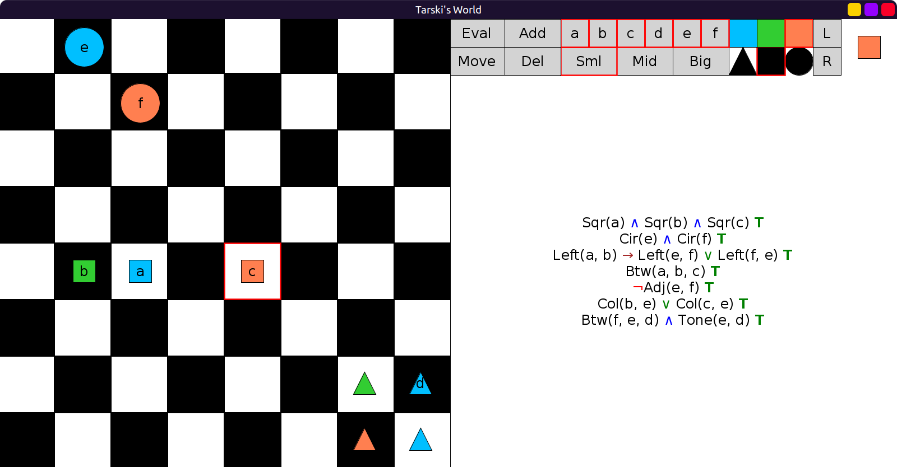

# 28 - solution

Here are the names:

```scala
val RebusWorld: Grid = Map(
  (0, 1) -> Block(Mid, Cir, Blu, "e"),
  (1, 2) -> Block(Mid, Cir, Red, "f"),
  (4, 1) -> Block(Sml, Sqr, Lim, "b"),
  (4, 2) -> Block(Sml, Sqr, Blu, "a"),
  (4, 4) -> Block(Sml, Sqr, Red, "c"),
  (6, 6) -> Block(Sml, Tri, Lim),
  (6, 7) -> Block(Sml, Tri, Blu, "d"),
  (7, 6) -> Block(Sml, Tri, Red),
  (7, 7) -> Block(Sml, Tri, Blu)
)
```


