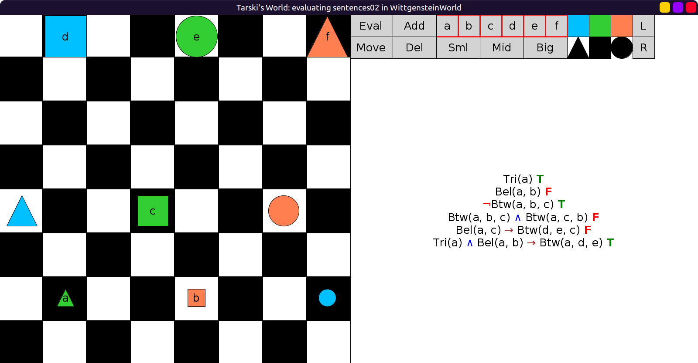

# 02 - solution

Here are the sentences:

```scala
val sentences02 = Seq(
  fof"Tri(a)",
  fof"Bel(a, b)",
  fof"¬Btw(a, b, c)",
  fof"Btw(a, b, c) ∧ Btw(a, c, b)",
  fof"Bel(a, c) → Btw(d, e, c)",
  fof"(Tri(a) ∧ Bel(a, b)) → Btw(a, d, e)"
)
```

Here is the evaluation:


