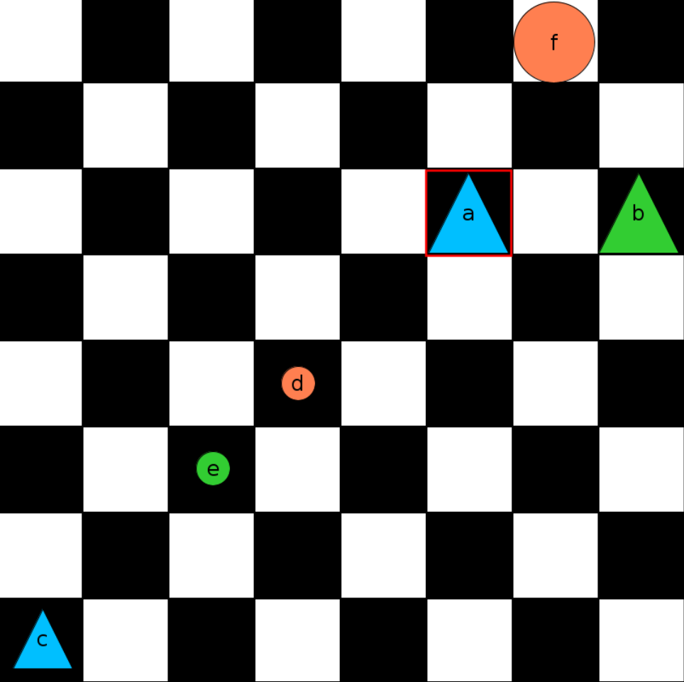

# 06 - Describe a world

1. Here is a picture of Boole’s World:

   

2. You will describe some features of this world in `sentences06`.
3. Then you will check each of your sentences to see that it
   is indeed a sentence and that it is true in this world.
4. Notice that f (the big circle at the top) is
   not below a. Use your first sentence to say this.
5. Notice that f is to the right of a and to the left of b.
   Use your second sentence to say this.
6. Use your third sentence to say that f is either above or smaller than a.
7. Express the fact that both e and d are between c and a.
8. Note that neither e nor d is bigger than c. Use your fifth sentence to say this.
9. Notice that e is neither bigger than nor smaller than d.
    Use your sixth sentence to say this.
10. Notice that c is smaller than a but bigger than e. State this fact.
11. Note that c is below f; moreover, it is smaller than f.
    Use your eighth sentence to state these things.
12. Notice that b is in the same row as a but is not in the same column as f.
    Use your ninth sentence to express this fact.
13. Notice that e is not in the same column as either c or d.
    Use your tenth sentence to state this.
14. Notice a has the same tone as c and the same shape as b. State this fact.
15. Notice d, e and f are all circles. State this as your 12th sentence.
16. Run the world and evaluate the sentences, they have to be all true. Check this.
17. Now let’s change the world so that none of the above mentioned facts hold.
    We can do this as follows.
18. First move f to the bottom right corner of the grid.
19. Then move e to the top left corner of the grid and make it big.
20. Change either the tone or the shape of a to something else.
21. Change at least one of d, e, or f to a shape that is not a circle.
22. Now none of the facts hold;
    if your answers to 4–15 are correct, all of the sentences should now be false.
23. Verify that they are. If any are still true, can you figure out where you went wrong?
