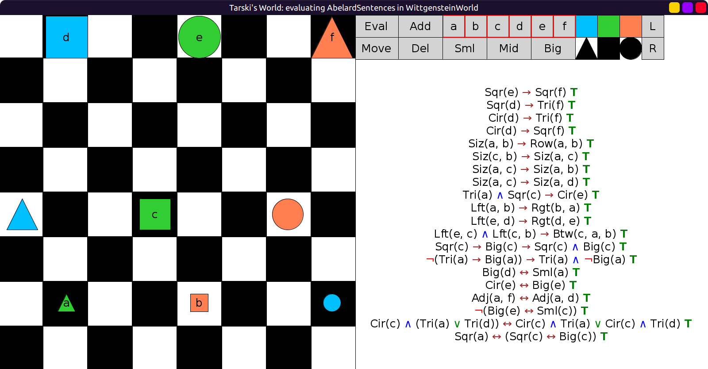

# 09 - Solution

Initially:


Changing names in the false sentences:

```scala
val AbelardSentences = Seq(
  fof"Sqr(e) → Sqr(f)", // change `d` to e
  fof"Sqr(d) → Tri(f)",
  fof"Cir(d) → Tri(f)",
  fof"Cir(d) → Sqr(f)",
  fof"Siz(a, b) → Row(a, b)",
  fof"Siz(c, b) → Siz(a, c)", // change first a to c
  fof"Siz(a, c) → Siz(a, b)",
  fof"Siz(a, c) → Siz(a, d)",
  fof"(Tri(a) ∧ Sqr(c)) → Cir(e)", // change `d` to e
  fof"Lft(a, b) → Rgt(b, a)",
  fof"Lft(e, d) → Rgt(d, e)",
  fof"(Lft(e, c) ∧ Lft(c, b)) → Btw(c, a, b)", // change first a to e
  fof"Sqr(c) → (Big(c) → (Sqr(c) ∧ Big(c)))",
  fof"¬(Tri(a) → Big(a)) → (Tri(a) ∧ ¬Big(a))",
  fof"Big(d) ↔ Sml(a)",
  fof"Cir(e) ↔ Big(e)", // change both `d` to e
  fof"Adj(a, f) ↔ Adj(a, d)",
  fof"¬(Big(e) ↔ Sml(c))", // change `b` to c
  fof"(Cir(c) ∧ (Tri(a) ∨ Tri(d))) ↔ ((Cir(c) ∧ Tri(a)) ∨ (Cir(c) ∧ Tri(d)))",
  fof"Sqr(a) ↔ (Sqr(c) ↔ Big(c))" // change `b` to a
)
```

After the changes:


