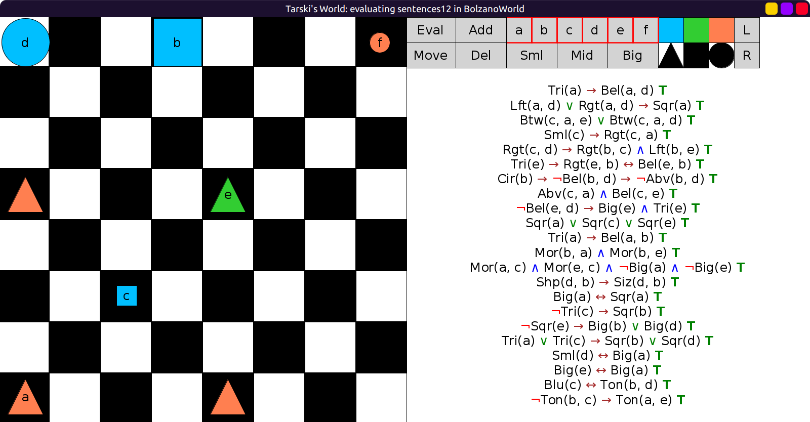
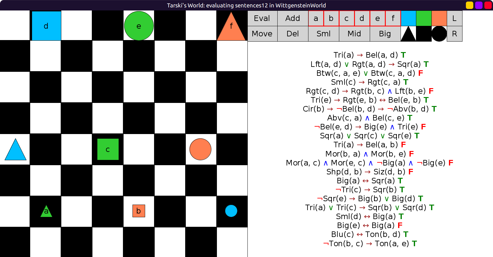
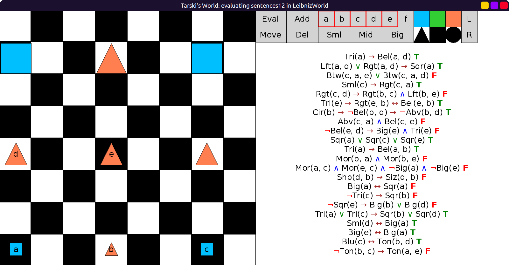
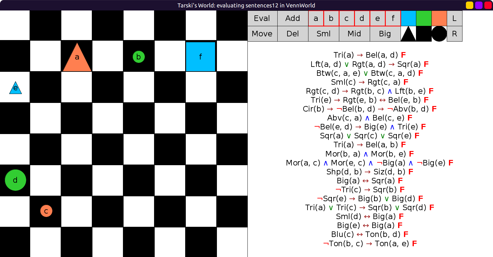

# 14 - Solution

Refer back to the solution for example 12.

Here are the worlds and `sentences12` evaluated in them:

1. In `BolzanoWorld`:
  
2. In `WittgensteinWorld`:
  
3. In `LeibnizWorld`:
  
4. In `VennWorld`:
  
