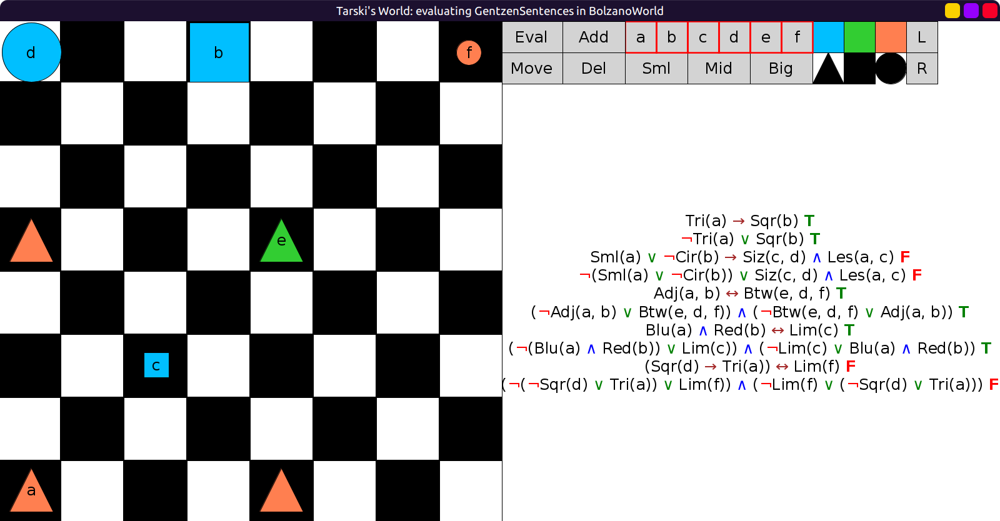
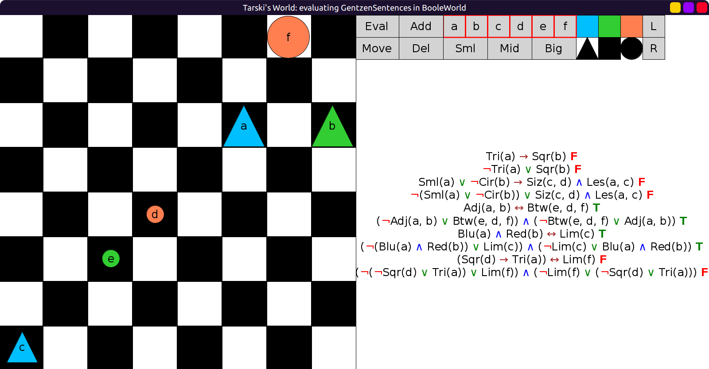
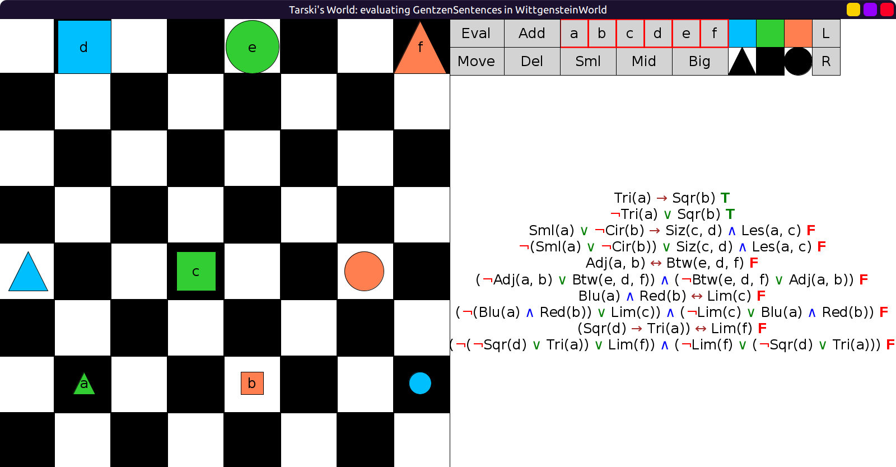

# 18 - solution

```scala
val GentzenSentences = Seq(
  fof"Tri(a) → Sqr(b)",
  fof"¬Tri(a) ∨ Sqr(b)",
  fof"(Sml(a) ∨ ¬Cir(b)) → (Size(c,d) ∧ Less(a,c))",
  fof"¬(Sml(a) ∨ ¬Cir(b)) ∨ (Size(c,d) ∧ Less(a,c))",
  fof"Adj(a,b) ↔ Btw(e,d,f)",
  fof"(¬Adj(a,b) ∨ Btw(e,d,f)) ∧ ((¬Btw(e,d,f) ∨ Adj(a,b)))",
  fof"(Blu(a) ∧ Red(b)) ↔ Lim(c)",
  fof"(¬(Blu(a) ∧ Red(b)) ∨ Lim(c)) ∧ (¬Lim(c) ∨ (Blu(a) ∧ Red(b)))",
  fof"(Sqr(d) → Tri(a)) ↔ Lim(f)",
  fof"(¬(¬Sqr(d) ∨ Tri(a)) ∨ Lim(f)) ∧ (¬Lim(f) ∨ (¬Sqr(d) ∨ Tri(a)))"
)
```

In `BolzanoWorld`:



In `BooleWorld`:



In `WittgensteinWorld`:


