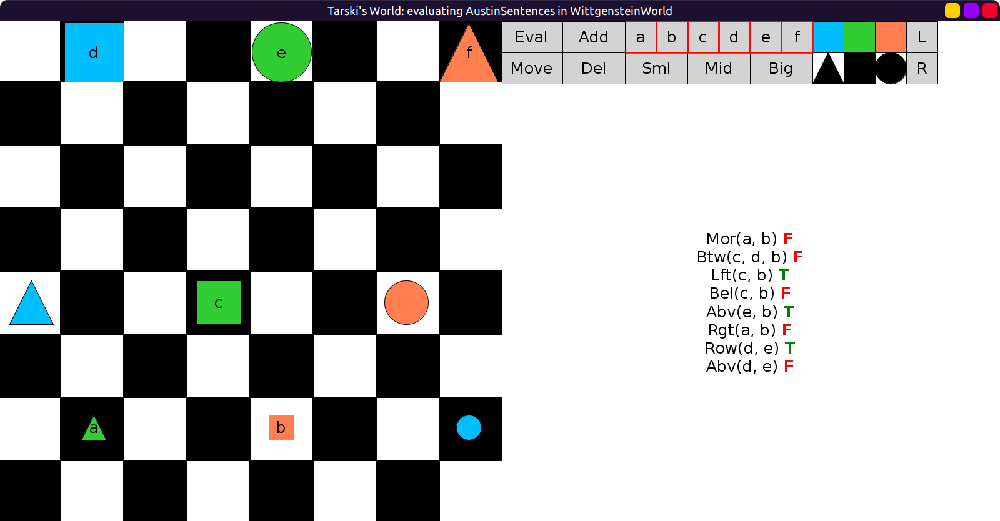
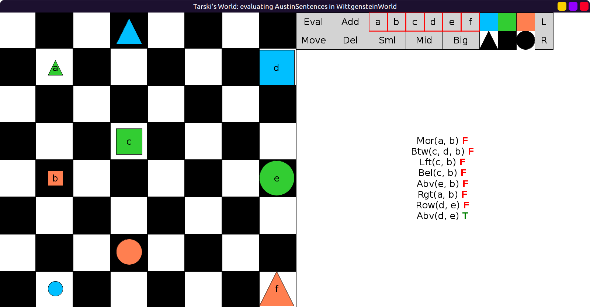
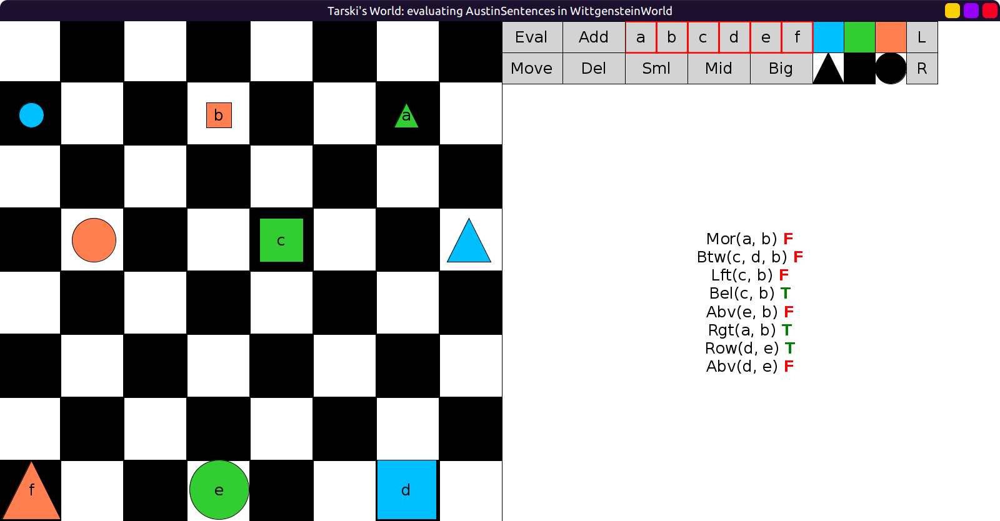
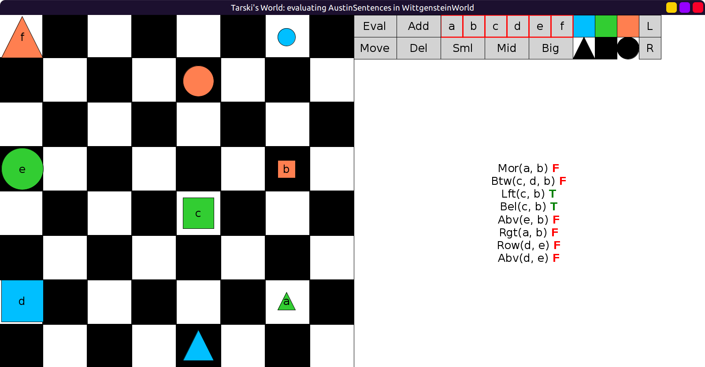

# 27 - solution

Here are the sentences 7,8,9:

```scala
val AustinSentences = Seq(
  fof"More(a, b)",
  fof"Btw(c, d, b)",
  fof"Left(c, b)",
  fof"Bel(c, b)",
  fof"Abv(e, b)",
  fof"Rgt(a, b)",
  fof"Row(d, e)", // added
  fof"Abv(d, e)", // added
  // not possible!
)
```

The ninth case (exactly three true values) is not possible with any atomic sentence.
But it is possible with the negation of an atomic sentence, e.g. `¬Abv(d, e)`.

## Table

Here is the filled table of truth values:

|No |Original|Rotate 90◦|Rotate 180◦|Rotate 270◦|
|:-:|:------:|:--------:|:---------:|:---------:|
|1  |   F    |    F     |     F     |     F     |
|2  |   F    |    F     |     F     |     F     |
|3  |   T    |    F     |     F     |     T     |
|4  |   F    |    F     |     T     |     T     |
|5  |   T    |    F     |     F     |     F     |
|6  |   F    |    F     |     T     |     F     |
|7  |   T    |    F     |     T     |     F     |
|8  |   F    |    T     |     F     |     F     |

You can see that number 7 has the TFTF pattern, and 8 has the FTFF pattern as needed.

## Evaluations

Here are the 4 evaluations: not rotated, rotated 90, then 180, then 270:








