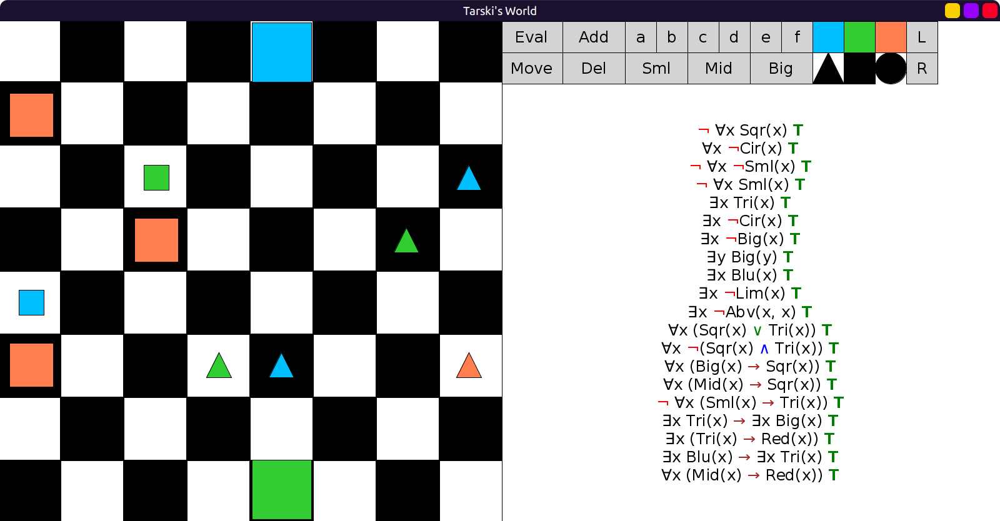
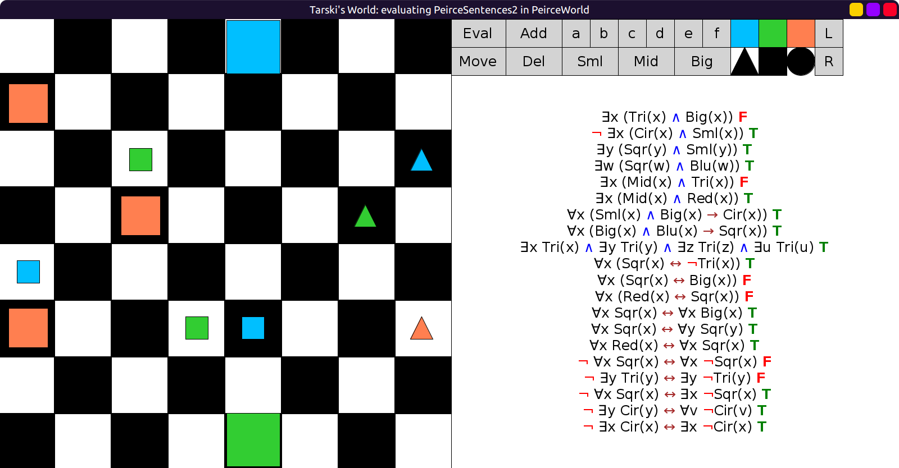
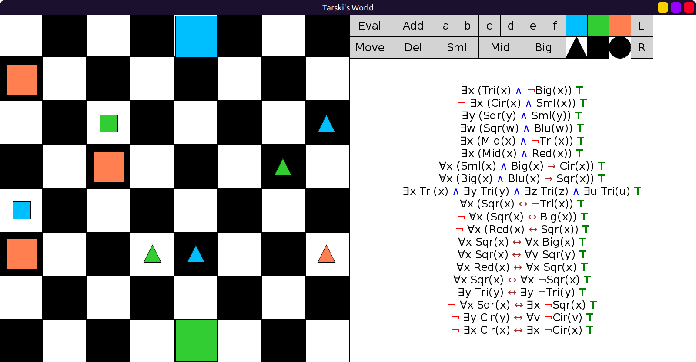

# 01 - solution

Here is one way to make all sentences true.
Generally, there are many ways for each false one to become true,
and placing a negation in the front always works.
So I tried to place / remove it somewhere else if possible.
But sometimes, placing a negation in the front is the only way 😄

```scala
val PeirceSentences1 = Seq(
  fof"¬ ∀x Sqr(x)", // was: ∀x Sqr(x)
  fof"∀x ¬Cir(x)",
  fof"¬ ∀x ¬Sml(x)", // was: ∀x ¬Sml(x)
  fof"¬(∀x Sml(x))",
  fof"∃x Tri(x)",
  fof"∃x ¬Cir(x)", // was: ∃x Cir(x)
  fof"∃x ¬Big(x)",
  fof"∃y Big(y)", // was: ¬(∃y Big(y))
  fof"∃x Blu(x)",
  fof"∃x ¬Lim(x)",
  fof"∃x ¬Abv(x,x)", // was: ∃x Abv(x,x)
  fof"∀x (Sqr(x) ∨ Tri(x))",
  fof"∀x ¬(Sqr(x) ∧ Tri(x))", // was: ∀x (Sqr(x) ∧ Tri(x))
  fof"∀x (Big(x) → Sqr(x))",
  fof"∀x (Mid(x) → Sqr(x))",
  fof"¬ ∀x (Sml(x) → Tri(x))", // was: ∀x (Sml(x) → Tri(x))
  fof"∃x Tri(x) → ∃x Big(x)",
  fof"∃x (Tri(x) → Red(x))",
  fof"∃x Blu(x) → ∃x Tri(x)",
  fof"∀x (Mid(x) → Red(x))"
)
```

Before:


After:



```scala
val PeirceSentences2 = Seq(
  fof"∃x (Tri(x) ∧ ¬Big(x))", // was: ∃x (Tri(x) ∧ Big(x))
  fof"¬ ∃x (Cir(x) ∧ Sml(x))",
  fof"∃y (Sqr(y) ∧ Sml(y))",
  fof"∃w (Sqr(w) ∧ Blu(w))",
  fof"∃x (Mid(x) ∧ ¬Tri(x))", // was: ∃x (Mid(x) ∧ Tri(x))
  fof"∃x (Mid(x) ∧ Red(x))",
  fof"∀x ((Sml(x) ∧ Big(x)) → Cir(x))",
  fof"∀x ((Big(x) ∧ Blu(x)) → Sqr(x))",
  fof"∃x Tri(x) ∧ ∃y Tri(y) ∧ ∃z Tri(z) ∧ ∃u Tri(u)",
  fof"∀x (Sqr(x) ↔ ¬Tri(x))",
  fof"¬ ∀x (Sqr(x) ↔ Big(x))", // was: ∀x (Sqr(x) ↔ Big(x))
  fof"¬ ∀x (Red(x) ↔ Sqr(x))", // was: ∀x (Red(x) ↔ Sqr(x))
  fof"∀x Sqr(x) ↔ ∀x Big(x)",
  fof"∀x Sqr(x) ↔ ∀y Sqr(y)",
  fof"∀x Red(x) ↔ ∀x Sqr(x)",
  fof"∀x Sqr(x) ↔ ∀x (¬Sqr(x))", // was: ¬(∀x Sqr(x)) ↔ ∀x (¬Sqr(x))
  fof"∃y Tri(y) ↔ ∃y (¬Tri(y))", // was: ¬(∃y Tri(y)) ↔ ∃y (¬Tri(y))
  fof"¬(∀x Sqr(x)) ↔ ∃x (¬Sqr(x))",
  fof"¬(∃y Cir(y)) ↔ ∀v (¬Cir(v))",
  fof"¬(∃x Cir(x)) ↔ ∃x (¬Cir(x))"
)
```

Before:



After:


