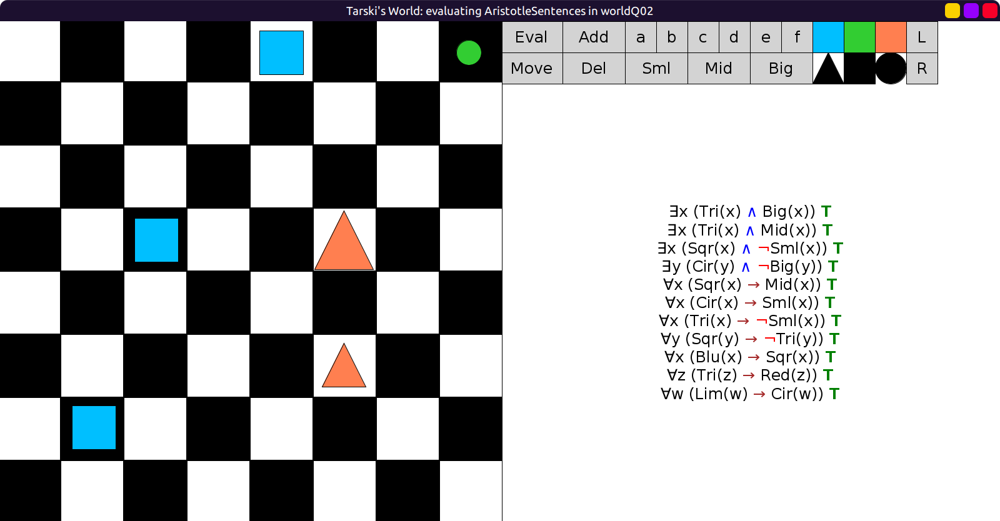

# 02 - solution

Here is one world that satisfies all `AristotleSentences`:

```scala
val worldQ02: Grid = Map(
  (0, 4) -> Block(Mid, Sqr, Blu),
  (0, 7) -> Block(Sml, Cir, Lim),
  (3, 2) -> Block(Mid, Sqr, Blu),
  (3, 5) -> Block(Big, Tri, Red),
  (5, 5) -> Block(Mid, Tri, Red),
  (6, 1) -> Block(Mid, Sqr, Blu)
)
```


