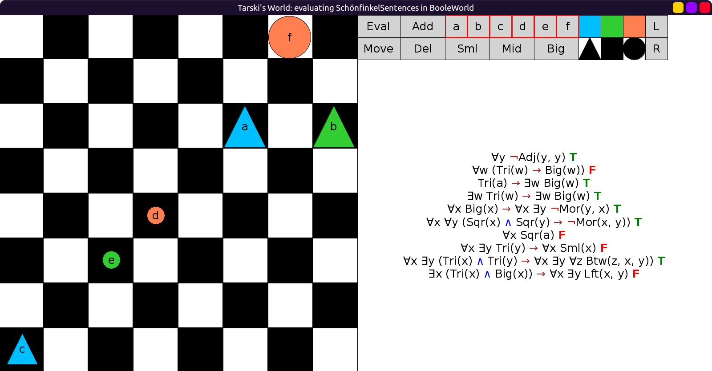

# 04 - solution

Here is one way, note that you can use ∀ / ∃ interchangeably:

```scala
val SchönfinkelSentences = Seq(
  fof"∀y ¬Adj(y, y)",
  fof"∀w(Tri(w) → Big(w))",
  fof"Tri(a) → ∃w Big(w)",
  fof"∃w Tri(w) → ∃w Big(w)",
  fof"∀x Big(x) → ∀x ∃y ¬More(y, x)",
  fof"∀x ∀y ((Sqr(x) ∧ Sqr(y)) → ¬More(x, y))",
  fof"∀x Sqr(a)",
  fof"∀x ∃y Tri(y) → ∀x Sml(x)",
  fof"∀x ∃y ((Tri(x) ∧ Tri(y)) → ∀x ∃y ∀z Btw(z,x,y))",
  fof"∃x (Tri(x) ∧ Big(x)) → ∀x ∃y Left(x,y)"
)
```

Evaluates without errors:


