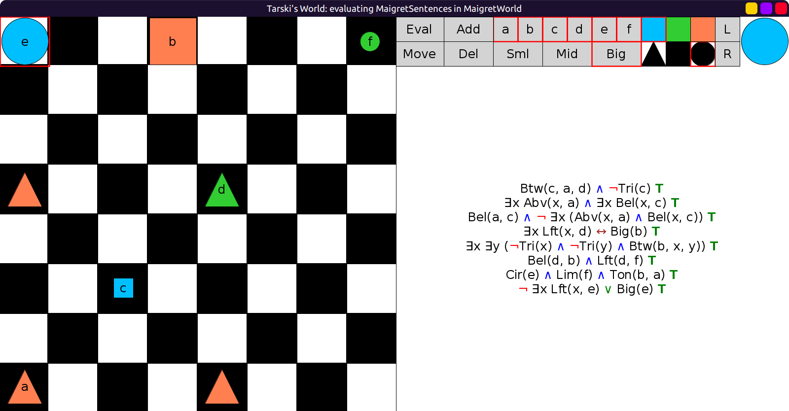

# 05 - solution

Here are the names:

```scala
val MaigretWorld: Grid = Map(
  (0, 0) -> Block(Big, Cir, Blu, "e"),
  (0, 3) -> Block(Big, Sqr, Red, "b"),
  (0, 7) -> Block(Sml, Cir, Lim, "f"),
  (3, 0) -> Block(Mid, Tri, Red),
  (3, 4) -> Block(Mid, Tri, Lim, "d"),
  (5, 2) -> Block(Sml, Sqr, Blu, "c"),
  (7, 0) -> Block(Mid, Tri, Red, "a"),
  (7, 4) -> Block(Mid, Tri, Red)
)
```

Evaluation with the names in place:


