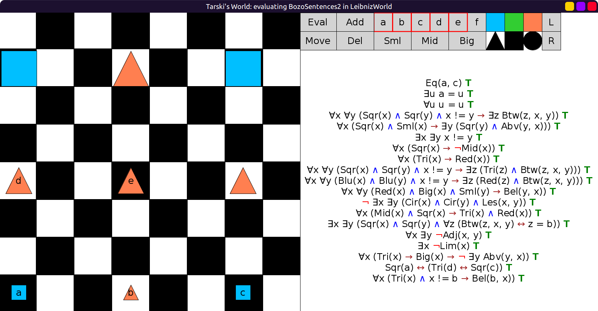

# 08 - solution

```scala
val BozoSentences2 = Seq(
  fof"a = c",
  fof"∃u (a = u)",
  fof"∀u (u = u)",
  fof"∀x ∀y (Sqr(x) ∧ Sqr(y) ∧ ¬Loc(x, y) → ∃z Btw(z, x, y))",
  fof"∀x ((Sqr(x) ∧ Sml(x)) → ∃y (Sqr(y) ∧ Abv(y, x)))",
  fof"∃x ∃y ¬Loc(x, y)",
  fof"∀x (Sqr(x) → ¬Mid(x))",
  fof"∀x (Tri(x) → Red(x))",
  fof"∀x ∀y ((Sqr(x) ∧ Sqr(y) ∧ x != y) → ∃z (Tri(z) ∧ Btw(z, x, y)))",
  fof"∀x ∀y ((Blu(x) ∧ Blu(y) ∧ x != y) → ∃z (Red(z) ∧ Btw(z, x ,y)))",
  fof"∀x ∀y ((Red(x) ∧ Big(x) ∧ Sml(y)) → Bel(y, x))",
  fof"¬ ∃x ∃y (Cir(x) ∧ Cir(y) ∧ Less(x, y))",
  fof"∀x (Mid(x) ∧ Sqr(x) → Tri(x) ∧ Red(x))",
  fof"∃x ∃y (Sqr(x) ∧ Sqr(y) ∧ ∀z (Btw(z, x, y) ↔ Loc(z, b)))",
  fof"∀x ∃y ¬Adj(x, y)",
  fof"∃x ¬Lim(x)",
  fof"∀x (Tri(x) → (Big(x) → ¬ ∃y Abv(y,x)))",
  fof"Sqr(a) ↔ (Tri(d) ↔ Sqr(c))",
  fof"∀x (Tri(x) ∧ ¬Loc(x, b) → Bel(b, x))"
)
```


