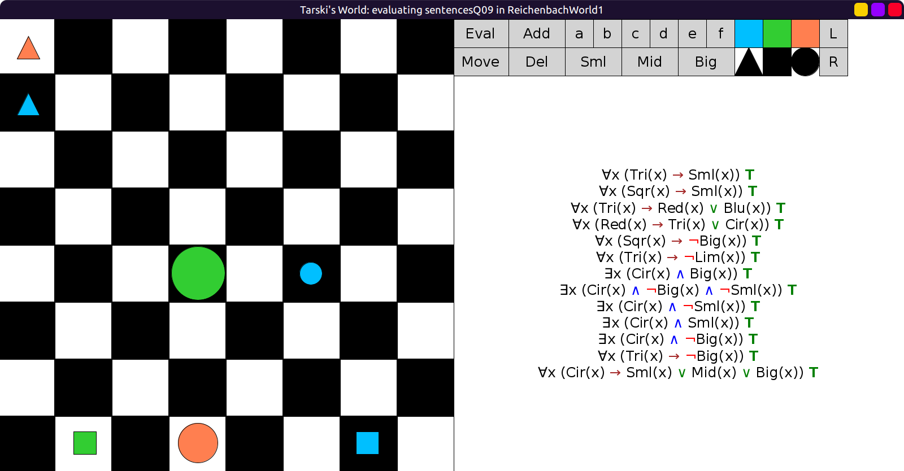
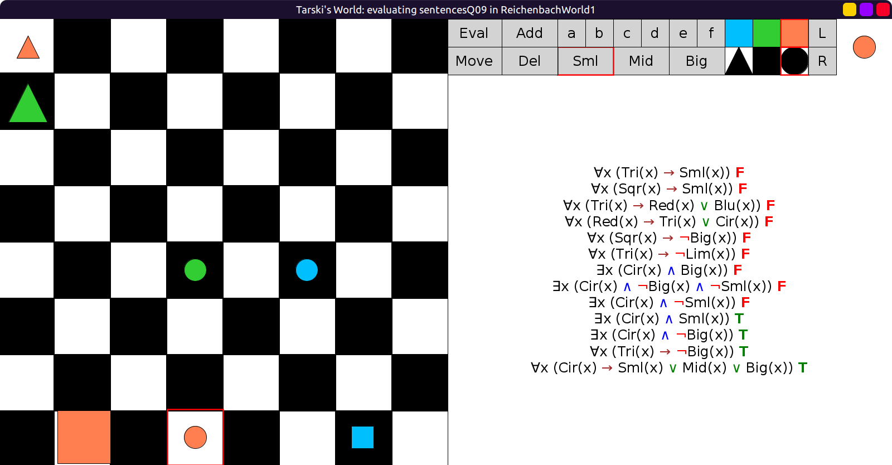

# 09 - solution

```scala
val sentencesQ09 = Seq(
  fof"∀x (Tri(x) → Sml(x))",
  fof"∀x (Sqr(x) → Sml(x))",
  fof"∀x (Tri(x) → (Red(x) ∨ Blu(x)))",
  fof"∀x (Red(x) → (Tri(x) ∨ Cir(x)))",
  fof"∀x (Sqr(x) → ¬Big(x))", // can also be: ¬ ∃x(Sqr(x) ∧ Big(x))
  fof"∀x (Tri(x) → ¬Lim(x))", // can also be: ¬ ∃x(Tri(x) ∧ Lim(x))
  fof"∃x (Cir(x) ∧ Big(x))",
  fof"∃x (Cir(x) ∧ ¬Big(x) ∧ ¬Sml(x))",
  fof"∃x (Cir(x) ∧ ¬Sml(x))",
  fof"∃x (Cir(x) ∧ Sml(x))",
  fof"∃x (Cir(x) ∧ ¬Big(x))",
  fof"∀x (Tri(x) → ¬Big(x))", // can also be: ¬ ∃x(Tri(x) ∧ Big(x))
  fof"∀x (Cir(x) → (Sml(x) ∨ Mid(x) ∨ Big(x)))"
)
```

Initial evaluation, all true:



After making the changes, first 9 false:


