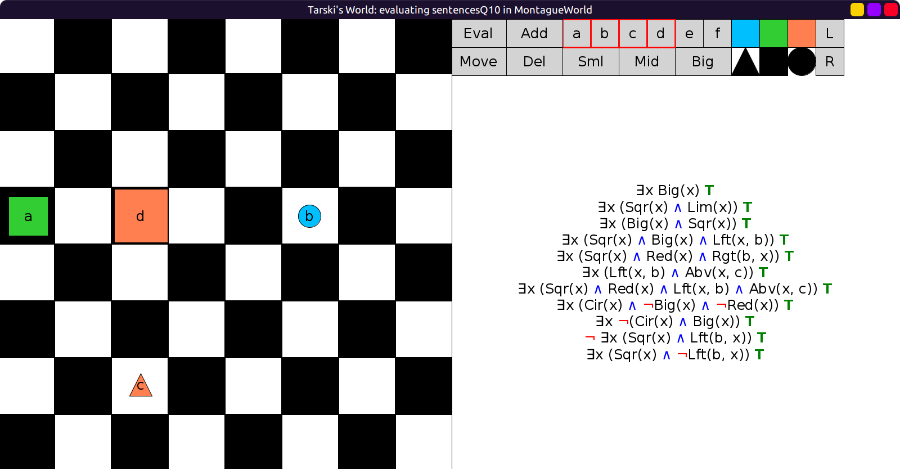
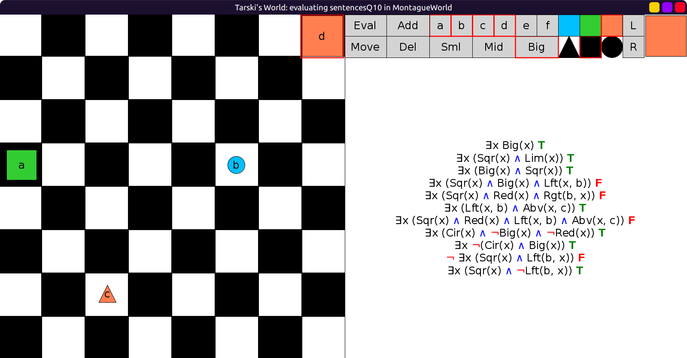
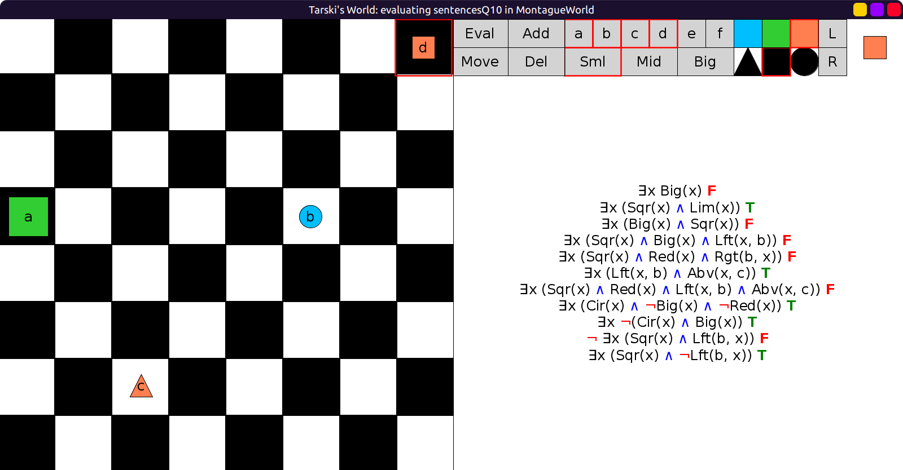
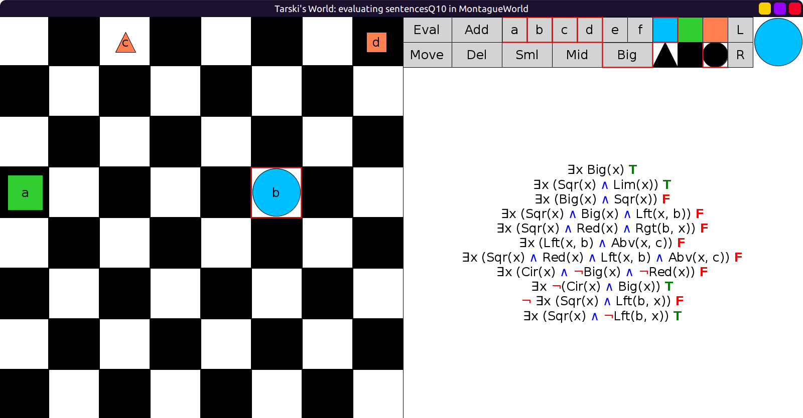

# 10 - solution

```scala
val sentencesQ10 = Seq(
  fof"∃x Big(x)",                                     // something is big
  fof"∃x (Sqr(x) ∧ Lim(x))",                          // something is a lime square
  fof"∃x (Big(x) ∧ Sqr(x))",                          // some square is big
  fof"∃x (Sqr(x) ∧ Big(x) ∧ Left(x, b))",             // b has a big square to its left
  fof"∃x (Sqr(x) ∧ Red(x) ∧ Rgt(b, x))",              // b is to the right of a red square
  fof"∃x (Left(x, b) ∧ Abv(x, c))",                   // Something to the left of b is above c.
  fof"∃x (Sqr(x) ∧ Red(x) ∧ Left(x, b) ∧ Abv(x, c))", // A red square to the left of b is above c.
  fof"∃x (Cir(x) ∧ ¬Big(x) ∧ ¬Red(x))",               // Some circle is not big or red.
  fof"∃x ¬(Cir(x) ∧ Big(x))",                         // Something is not a big circle.
  fof"¬ ∃x(Sqr(x) ∧ Left(b, x))",                     // b is not to the left of a square.
  fof"∃x(Sqr(x) ∧ ¬Left(b, x))"                       // b is not to the left of a square.
)
```

Initial evaluation, all true:



Move the big square to the top right:



Make the big square small:



Move c to the top row, and make b big:


