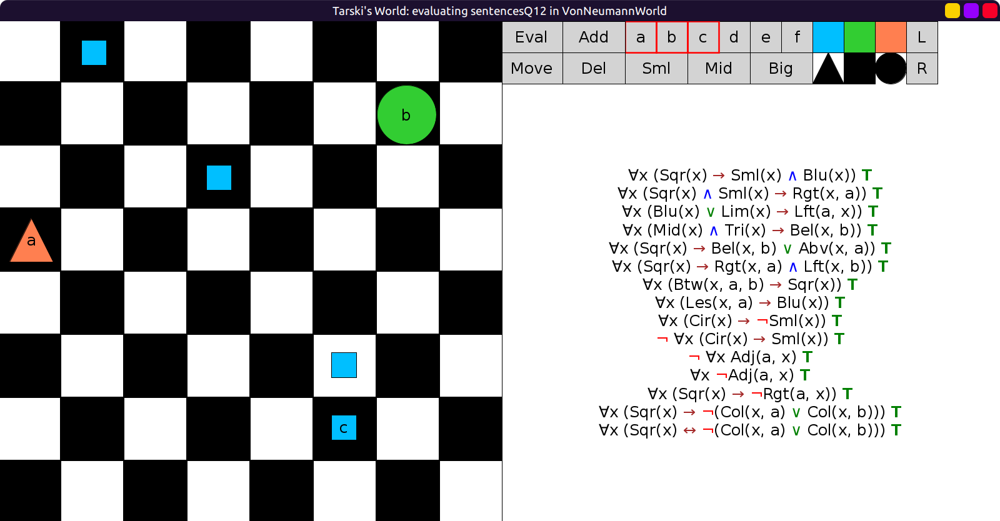
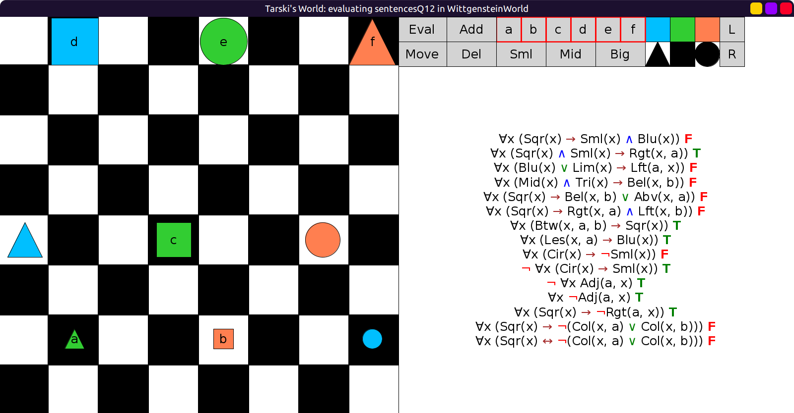
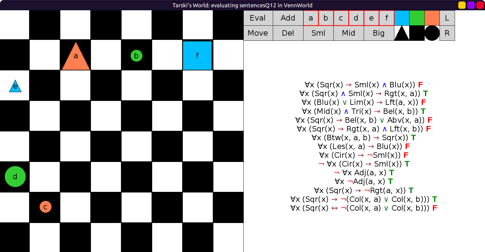

# 12 - solution

```scala
val sentencesQ12 = Seq(
  fof"∀x (Sqr(x) → Sml(x) ∧ Blu(x))",        // All squares are small and blue.
  fof"∀x (Sqr(x) ∧ Sml(x) → Rgt(x, a))",     // Each small square is to the right of a.
  fof"∀x (Blu(x) ∨ Lim(x) → Left(a, x))",    // a is to the left of every blue block and every red block.
  fof"∀x (Mid(x) ∧ Tri(x) → Bel(x, b))",     // Every medium triangle is below b.
  fof"∀x (Sqr(x) → Bel(x, b) ∨ Abv(x, a))",  // Each square is either below b or above a.
  fof"∀x (Sqr(x) → Rgt(x, a) ∧ Left(x, b))", // Every square is to the right of a and to the left of b.
  fof"∀x (Btw(x, a, b) → Sqr(x))",           // Everything between a and b is a square.
  fof"∀x (Less(x, a) → Blu(x))",             // Everything smaller than a is blue.
  fof"∀x (Cir(x) → ¬Sml(x))",                // No circle is small.
  fof"¬ ∀x(Cir(x) → Sml(x))",                // All circles are not small.
  fof"¬ ∀x Adj(a, x)",                       // a does not adjoin everything.
  fof"∀x ¬Adj(a, x)",                        // a does not adjoin anything.
  fof"∀x (Sqr(x) → ¬Rgt(a, x))",             // a is not to the right of any square.
  fof"∀x (Sqr(x) → ¬(Col(x, a) ∨ Col(x, b)))", // If something is a square, then it is not in the same column as either a or b.
  fof"∀x (Sqr(x) ↔ ¬(Col(x, a) ∨ Col(x, b)))" // Something is a square iff it is not in the same column as either a or b.
)
```

Initially in `ClaireWorld`:



After moving `a` below `c`:


In `WittgensteinWorld`:



In `VennWorld`:


