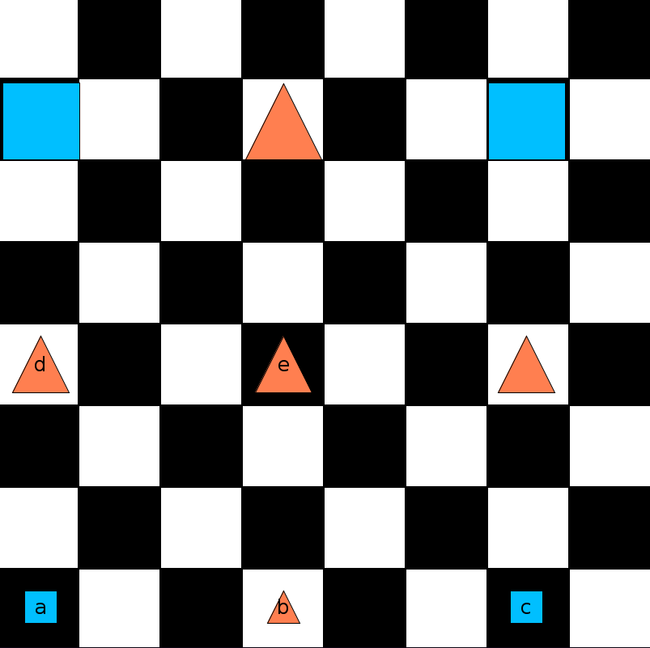

# 13 - Translation

- This time, we will translate some sentences while looking
  at the world they are meant to describe.
- Take a look at `LeibnizWorld`:
    
- Enter translations of the following sentences into `sentencesQ13`.
- Each of the English sentences is true in `LeibnizWorld`.
- As you go, check to make sure that your translation is indeed a true sentence.

1. There are no mid-sized squares.
    (Note: there are many ways to express this.
    You can start with ∀ or ¬∃.
    Also, you can say: "mid-sized but not square" or "square but not mid-sized"
    or "not both mid-sized and square" or "either not square or not mid-sized".
    Pick the one that you find the simplest and the most straightforward.
    Similarly for the rest of the sentences.)
2. Nothing is below b or lime.
3. Every square is either below or above e.
4. No square is between a and c.
5. Everything is in the same column as a, b, or c.
6. There are no red squares or blue triangles.

- Now let’s change the world so that none of the English sentences is true.
- We can do this as follows. First change `b` into a medium square.
- Next, delete `d` and move `b` to exactly the position just vacated by `d`.
- Finally, add a small square (of any tone) to exactly where `b` used to sit.
- If your answers to 1–6 are correct, all of the translations should now be false.
- Verify that they are.
- Make various changes to the world, so that some of the
  English sentences come out true and some come out false.
- Then check to see that the truth values of your translations
  track the truth values of the English sentences.

So far, most of the sentences we have looked at have had at most
one quantifier. In the next few examples, we delve into sentences that
contain more than one instance of ∀, or more than one instance of ∃.
