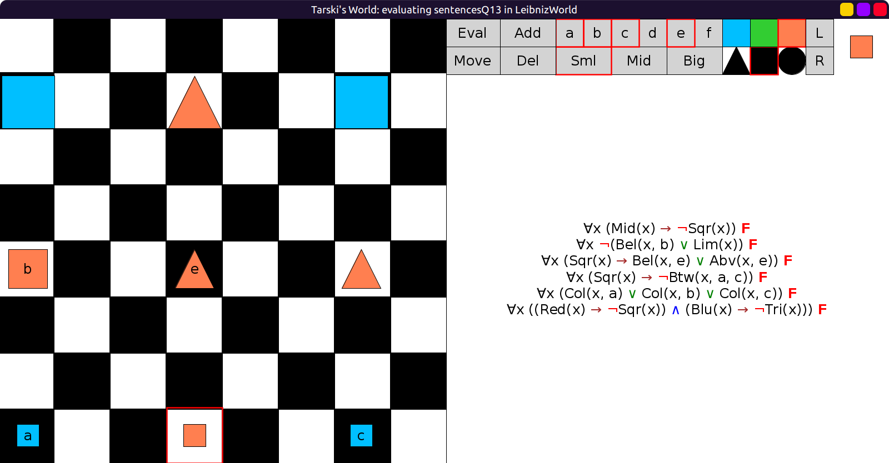

# 13 - solution

```scala
val sentencesQ13 = Seq(
  fof"∀x (Mid(x) → ¬Sqr(x))",                       // There are no medium-sized squares.
  fof"∀x ¬(Bel(x, b) ∨ Lim(x))",                    // Nothing is below b or lime.
  fof"∀x (Sqr(x) → (Bel(x, e) ∨ Abv(x, e)))",       // Every square is either below or above e.
  fof"∀x (Sqr(x) → ¬Btw(x, a, c))",                 // No square is between a and c.
  fof"∀x (Col(x, a) ∨ Col(x, b) ∨ Col(x, c))",      // Everything is in the same column as a, b, or c.
  fof"∀x ((Red(x) → ¬Sqr(x)) ∧ (Blu(x) → ¬Tri(x)))" // There are no red squares or blue triangles.
)
```

Initial evaluation, all true in `LeibnizWorld`:


After making the changes, now all false:


