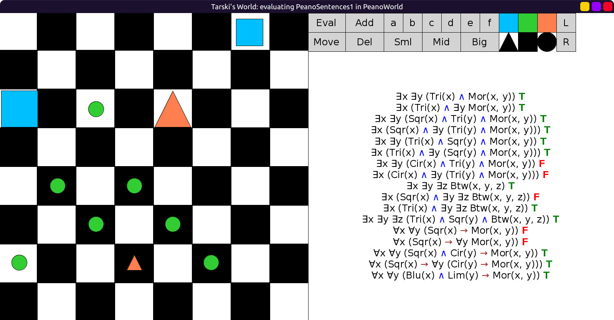
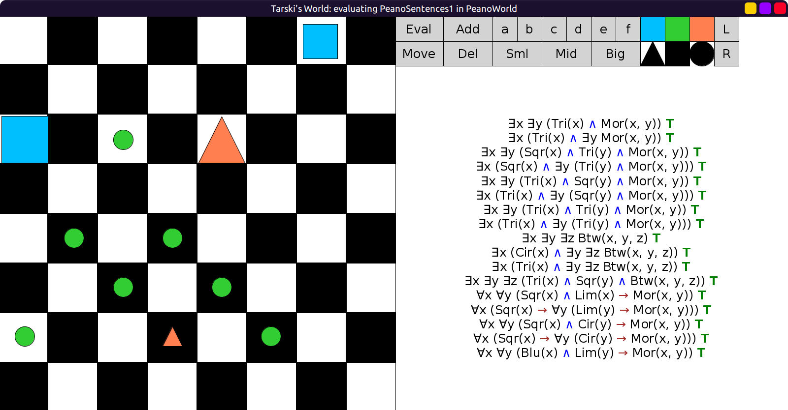
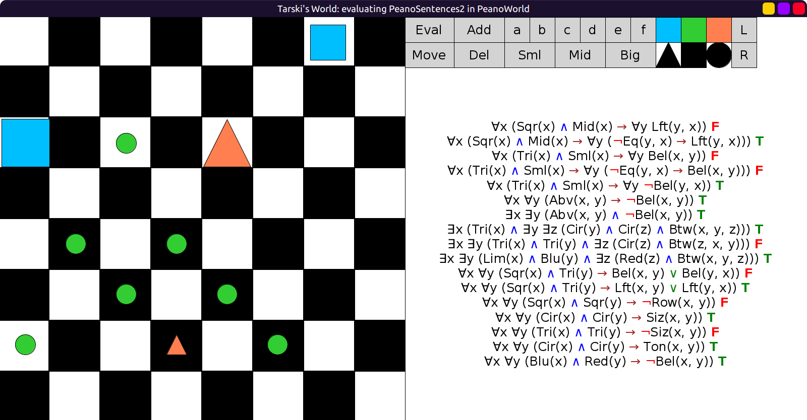
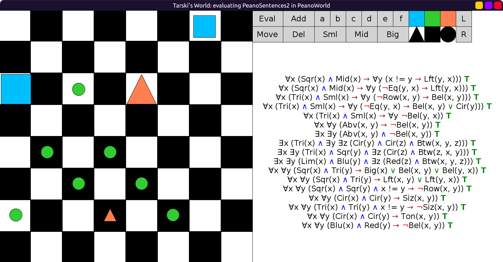

# 15 - solution

In `PeanoSentences1`, the false sentences are:

- ∃x ∃y (Cir(x) ∧ Tri(y) ∧ More(x, y)) (no. 7)
  - can be made true with:
  - ∃x ∃y (Tri(x) ∧ Tri(y) ∧ More(x, y))
- ∃x (Cir(x) ∧ ∃y (Tri(y) ∧ More(x, y))) (no. 8)
  - can be made true with:
  - ∃x (Tri(x) ∧ ∃y (Tri(y) ∧ More(x, y)))
- ∃x (Sqr(x) ∧ ∃y ∃z Btw(x, y, z)) (no. 10)
  - can be made true with:
  - ∃x (Cir(x) ∧ ∃y ∃z Btw(x, y, z))
  - also with Tri(x) (like no. 11)
- ∀x ∀y (Sqr(x) → More(x, y)) (no. 13)
  - can be made true with:
  - ∀x ∀y ((Sqr(x) ∧ Lim(y)) → More(x, y))
- ∀x (Sqr(x) → ∀y More(x, y)) (no. 14)
  - can be made true with:
  - ∀x (Sqr(x) → ∀y (Lim(y) → More(x, y)))

Initial evaluation (7, 8, 10, 13, 14 false):

After editing the sentences (all true):

In `PeanoSentences2`, the false sentences are:

- ∀x ((Sqr(x) ∧ Mid(x)) → ∀y Left(y, x)) (no. 1)
  - can be made true with:
  - ∀x ((Sqr(x) ∧ Mid(x)) → ∀y (Left(y, x) → x != y))
- ∀x ((Tri(x) ∧ Sml(x)) → ∀y Bel(x, y)) (no. 3)
  - can be made true with:
  - ∀x ((Tri(x) ∧ Sml(x)) → ∀y (¬Row(x, y) → Bel(x, y)))
- ∀x ((Tri(x) ∧ Sml(x)) → ∀y (y != x → Bel(x, y))) (no. 4)
  - can be made true with:
  - ∀x ((Tri(x) ∧ Sml(x)) → ∀y (y != x → (Bel(x, y) ∨ Cir(y))))
- ∃x ∃y (Tri(x) ∧ Tri(y) ∧ ∃z (Cir(z) ∧ Btw(z,x,y))) (no. 9)
  - can be made true with:
  - ∃x ∃y (Tri(x) ∧ Sqr(y) ∧ ∃z (Cir(z) ∧ Btw(z,x,y)))
- ∀x ∀y ((Sqr(x) ∧ Tri(y)) → (Bel(x, y) ∨ Bel(y, x))) (no. 11)
  - can be made true with:
  - ∀x ∀y ((Sqr(x) ∧ Tri(y)) → (Big(x) ∨ Bel(x, y) ∨ Bel(y, x)))
- ∀x ∀y ((Sqr(x) ∧ Sqr(y)) → ¬Row(x, y)) (no. 13)
  - can be made true with:
  - ∀x ∀y ((Sqr(x) ∧ Sqr(y) ∧ x != y) → ¬Row(x, y))
  - ¬Loc(x, y) also works instead of x != y
- ∀x ∀y ((Tri(x) ∧ Tri(y)) → ¬Size(x, y)) (no. 15)
  - can be made true with:
  - ∀x ∀y ((Tri(x) ∧ Tri(y) ∧ x != y) → ¬Size(x, y))

Initial evaluation (1, 3, 4, 9, 11, 13, 15 false):

After editing the sentences (all true):

