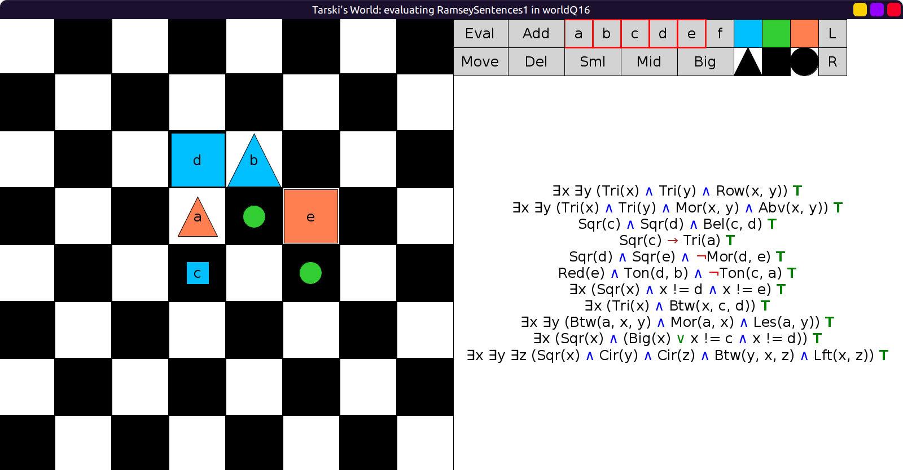
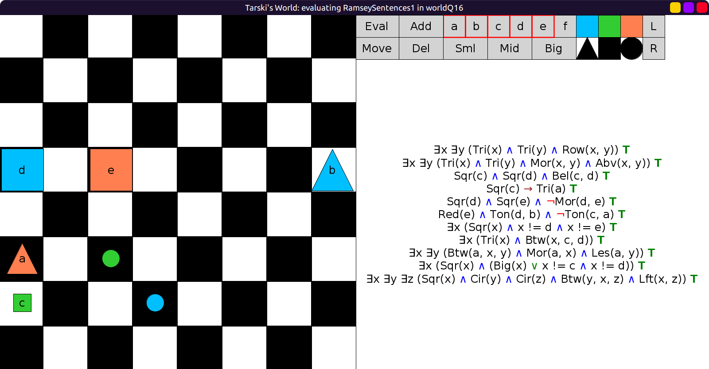
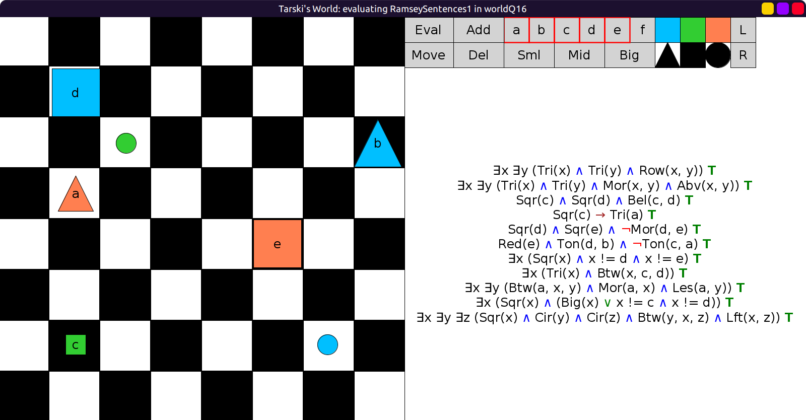

# 16 - solution

There are many solutions.
Here is one world where all `RamseySentences1` are true:

```scala
val worldQ16: Grid = Map(
  (2, 3) -> Block(Big, Sqr, Blu, "d"),
  (2, 4) -> Block(Big, Tri, Blu, "b"),
  (3, 3) -> Block(Mid, Tri, Red, "a"),
  (3, 4) -> Block(Sml, Cir, Lim),
  (3, 5) -> Block(Big, Sqr, Red, "e"),
  (4, 3) -> Block(Sml, Sqr, Blu, "c"),
  (4, 5) -> Block(Sml, Cir, Lim)
)
```

Evaluation, all true:



Here is another solution:

```scala
val worldQ16: Grid = Map(
  (3, 0) -> Block(Big, Sqr, Blu, "d"),
  (3, 2) -> Block(Big, Sqr, Red, "e"),
  (3, 7) -> Block(Big, Tri, Blu, "b"),
  (5, 0) -> Block(Mid, Tri, Red, "a"),
  (5, 2) -> Block(Sml, Cir, Lim),
  (6, 0) -> Block(Sml, Sqr, Lim, "c"),
  (6, 3) -> Block(Sml, Cir, Blu)
)
```

Evaluation, all true:



Here is another one, very similar with positions changed:

```scala
val worldQ16: Grid = Map(
  (1, 1) -> Block(Big, Sqr, Blu, "d"),
  (2, 2) -> Block(Sml, Cir, Lim),
  (2, 7) -> Block(Big, Tri, Blu, "b"),
  (3, 1) -> Block(Mid, Tri, Red, "a"),
  (4, 5) -> Block(Big, Sqr, Red, "e"),
  (6, 1) -> Block(Sml, Sqr, Lim, "c"),
  (6, 6) -> Block(Sml, Cir, Blu)
)
```

Evaluation, all true:


