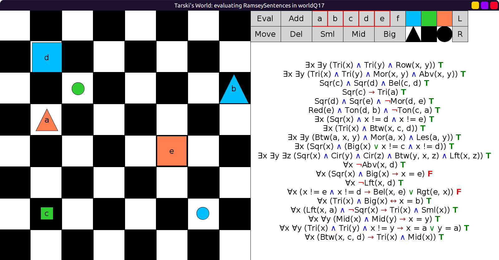
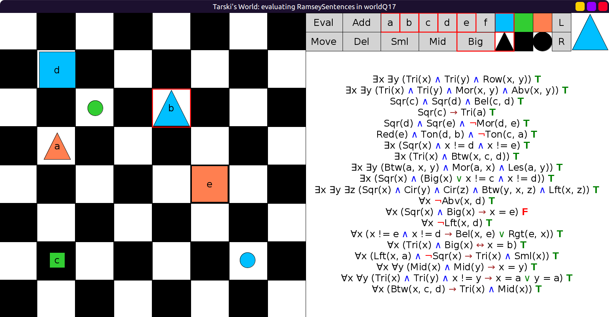
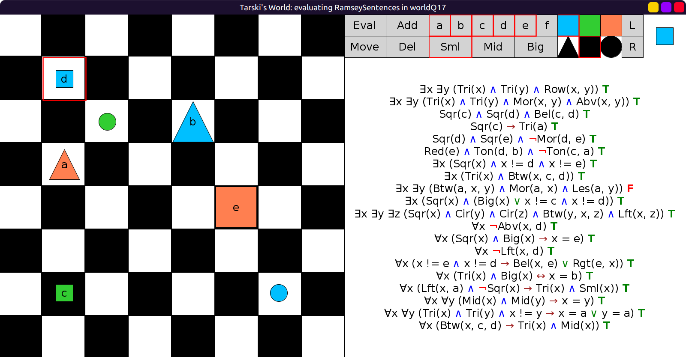
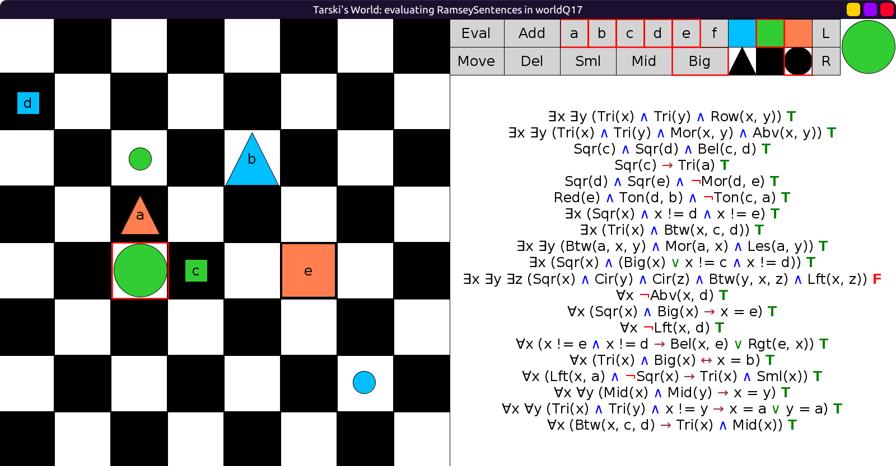
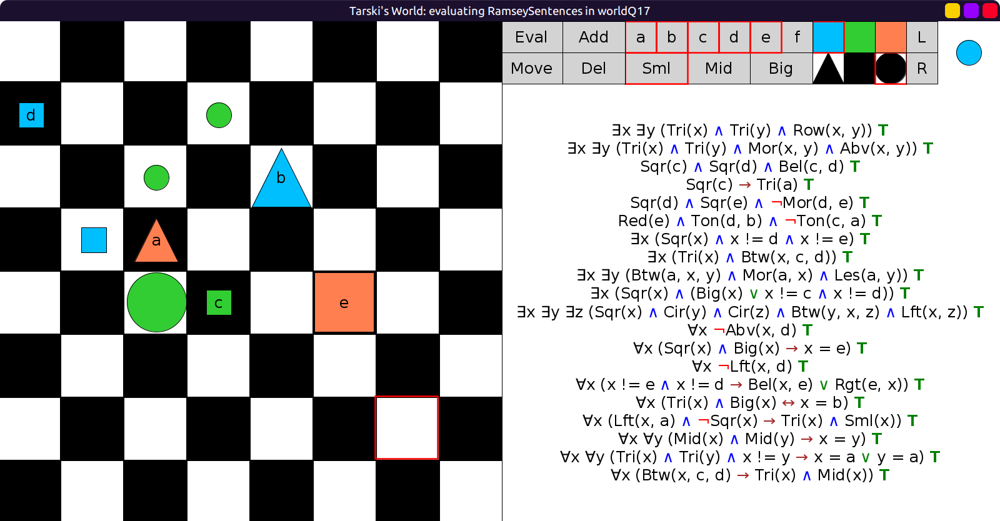

# 17 - solution

Here is one possible solution:

```scala
val worldQ17: Grid = Map(
  (1, 0) -> Block(Sml, Sqr, Blu, "d"),
  (1, 3) -> Block(Sml, Cir, Lim),
  (2, 2) -> Block(Sml, Cir, Lim),
  (2, 4) -> Block(Big, Tri, Blu, "b"),
  (3, 1) -> Block(Sml, Sqr, Blu),
  (3, 2) -> Block(Mid, Tri, Red, "a"),
  (4, 2) -> Block(Big, Cir, Lim),
  (4, 3) -> Block(Sml, Sqr, Lim, "c"),
  (4, 5) -> Block(Big, Sqr, Red, "e")
)
```

Initially, starting from one of the solutions of Example Q16,
only two sentences are false:



Move `b` to the left by 3 squares to satisfy the second false sentence:



The remaining false sentence says that the only big square is `e`.
So let's change `d` into a small square.
Now one of the previous sentences from Example Q16 became false:



This false sentence says that `a` is between two things,
one of which is smaller and the other bigger.
We move `a`, `c` and `d` so that they are on a diagonal,
and add a small and a big circle above and below `a`.
This turns the sentence true, but now the last Example Q16 sentence is false:



This sentence says that a circle is between
a square on the left and a circle on the right.
So add a small square to its bottom left, a circle to its top right.
We can also remove the unnecessary blue circle at the bottom right:


