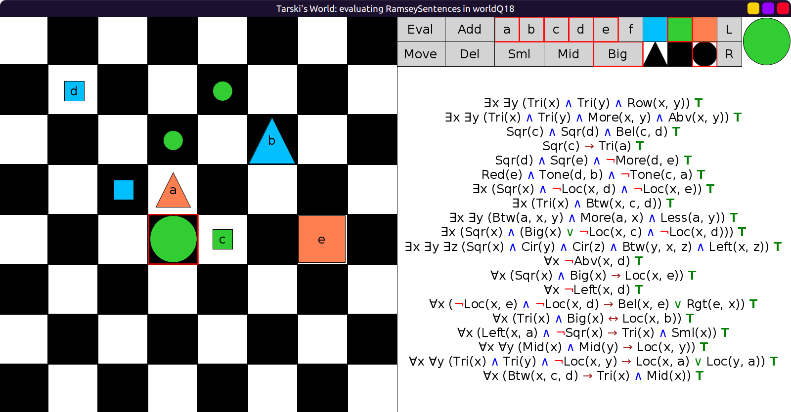

# 18 - Expanding a world

- In the real world, things change in various ways.
- They come, move around, and go.
- And as things change, so do the truth values of sentences.
- In this example, you start in a world where all `RamseySentences` are true:

- Your goal is to make as many of `RamseySentences` false as you can.
- But here's the catch: you can only add objects of various sizes and shapes;
  don't change the existing objects in any way.
- Take a screenshot of your changes to `worldQ18`.
- Do you notice anything about which sentences you can make
  false in this way and which you cannot?
- Try to give a fairly clear and intuitive account of which
  sentences you cannot make false in this way.
