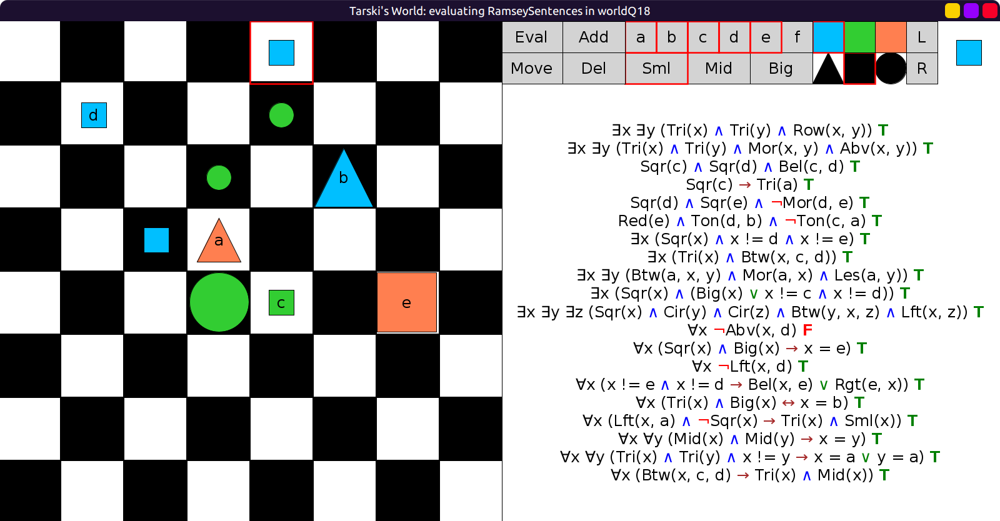
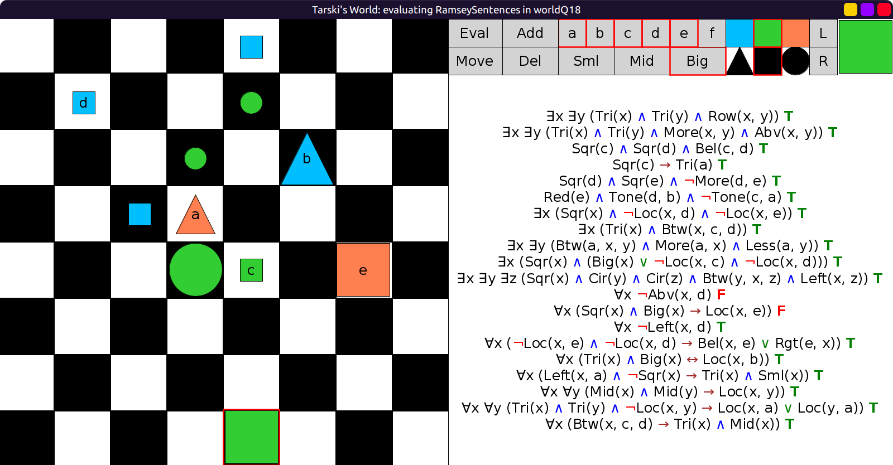
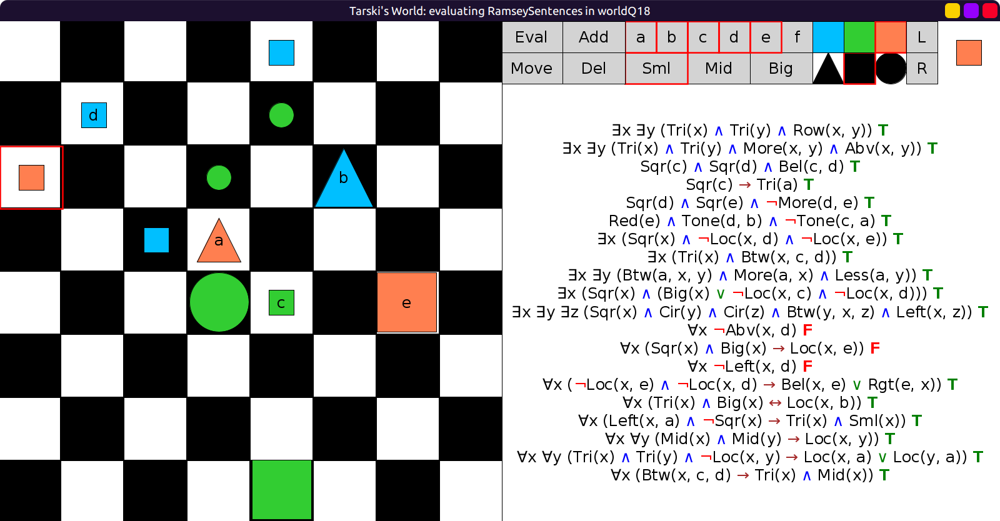
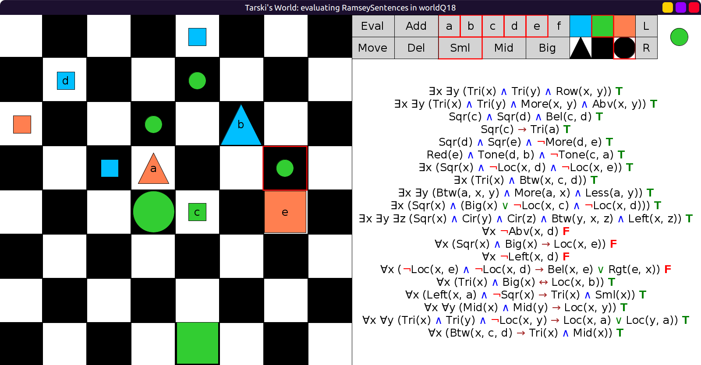
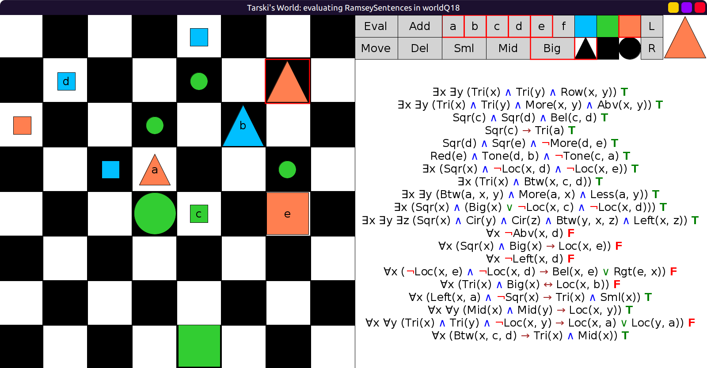
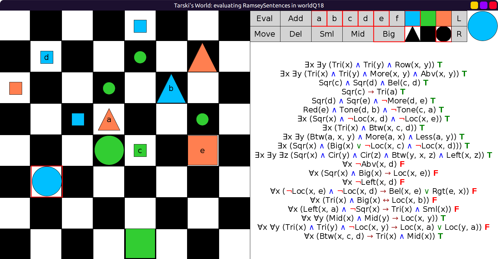
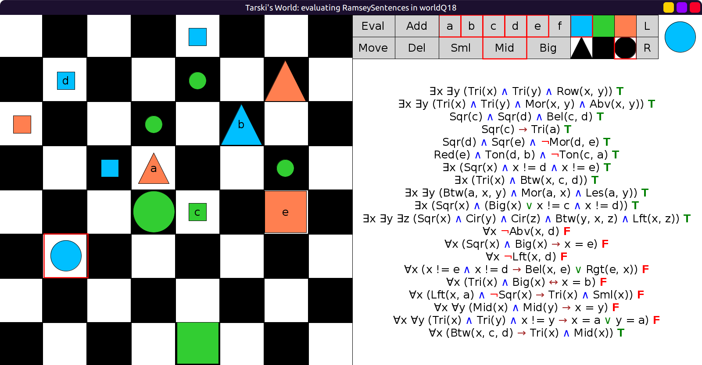
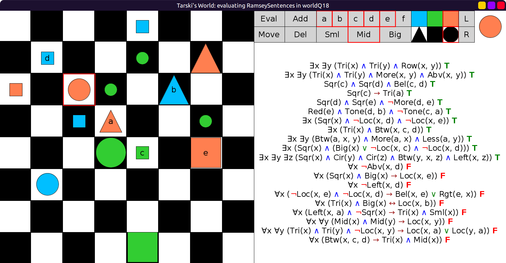

# 18 - solution

Since we are not allowed to change the existing blocks,
we cannot make any of the existential or purely literal sentences false.
They will always be true because of the existing blocks on the board.

We can make the remaining 9 (universal) sentences false.

Sentence 11: ∀x ¬Abv(x, d) says that there is nothing above `d`.
We can make it false by adding a block above `d`:

Sentence 12: ∀x ((Sqr(x) ∧ Big(x)) → x = e) says that
the only big square is `e`. We can make it false by adding a big square:

Sentence 13: ∀x ¬Lft(x, d) says there is nothing to the left of `d`.
We can make this false by adding a block to the left of `d`:

Sentence 14: ∀x (x != e ∧ x != d → (Bel(x, e) ∨ Rgt(e, x))) says
that for any block other than `d` and `e`,
it is either below `e`, or `e` is to the right of it.
We can make it false by adding a counterexample.
Add a block that is neither below `e`, nor `e` is to the right of it:

Sentence 15: ∀x ((Tri(x) ∧ Big(x)) ↔ x = b) says that the only big triangle is `b`.
We can make it false by adding another big triangle:

This has the side effect of making Sentence 19 false too,
because it says that for any two triangles that are not identical,
one of them must be `a`. Previously there were 2 triangles `a` and `b`,
and now there is a third one, therefore the sentence is false.

Sentence 16: ∀x ((Lft(x, a) ∧ ¬Sqr(x)) → (Tri(x) ∧ Sml(x))) says that
any block to the left of `a` that is not a square must be a small triangle.
We can make this false by adding a non-square to the left of `a` that is not small:

Sentence 17: ∀x ∀y ((Mid(x) ∧ Mid(y)) → x = y) says that
there is only one mid-sized block.
We can make it false by adding a second mid-sized block.
I'll simply change the block from the previous step to be mid-sized:

Sentence 19: ∀x ∀y ((Tri(x) ∧ Tri(y) ∧ x != y) → (x = a ∨ y = a))
was handled above.

Sentence 20: ∀x (Btw(x, c, d) → (Tri(x) ∧ Mid(x))) says that
any block between `c` and `d` must be a mid-sized triangle.
We can make it false by adding any other kind of block between `c` and `d`:

