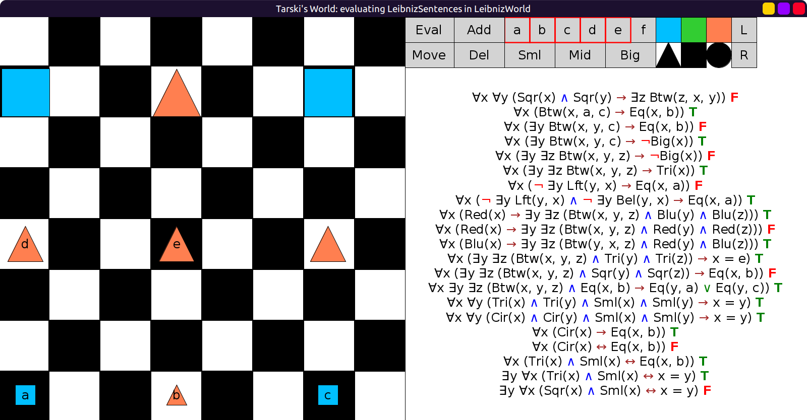

# 20 - solution

Initial evaluation:



To fix the first sentence, you can add `¬Eq(x, y)` or `¬Loc(x, y)`. Either one works:

```scala
fof"∀x ∀y ((Sqr(x) ∧ Sqr(y) ∧ ¬Eq(x, y)) → ∃z Btw(z, x, y))"
```

For the last sentence that says "there is exactly one large triangle" use:

```scala
fof"∃y ∀x ((Tri(x) ∧ Big(x)) ↔ Loc(x, y))"
```
