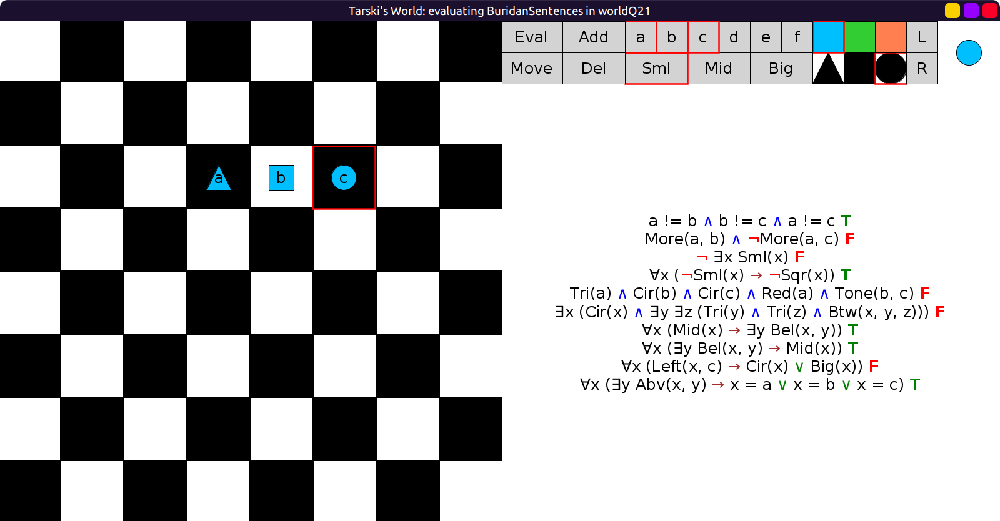
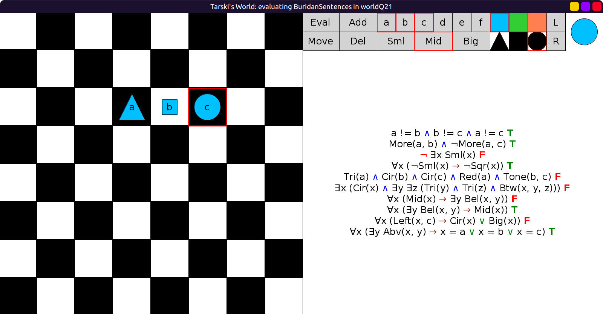
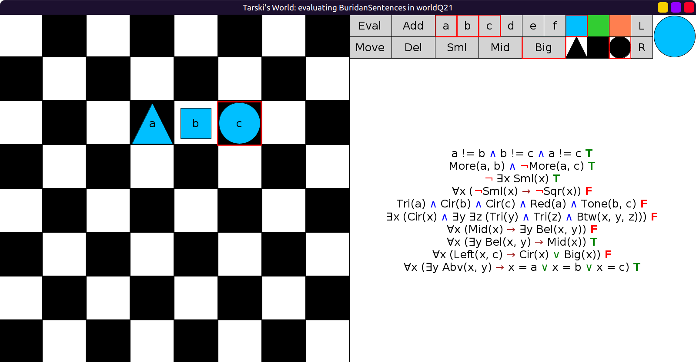
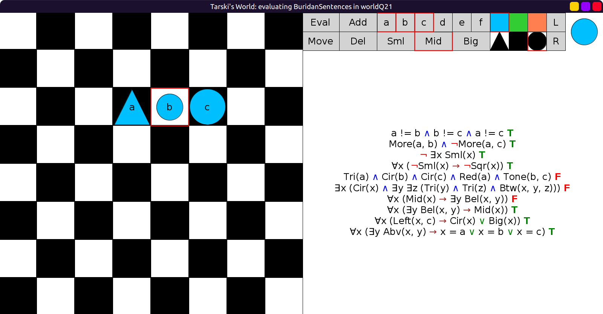
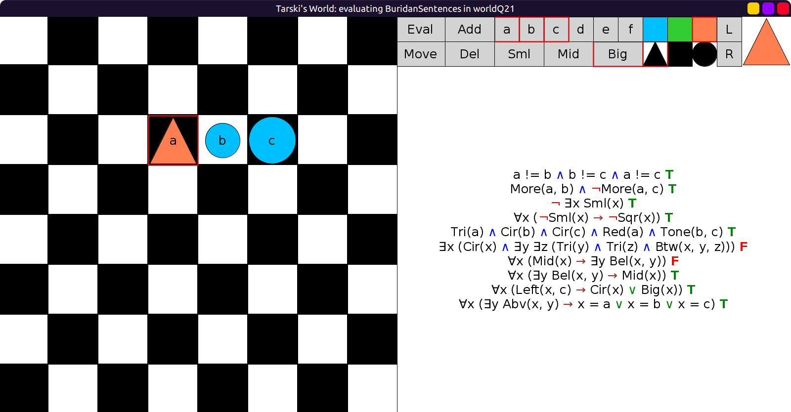
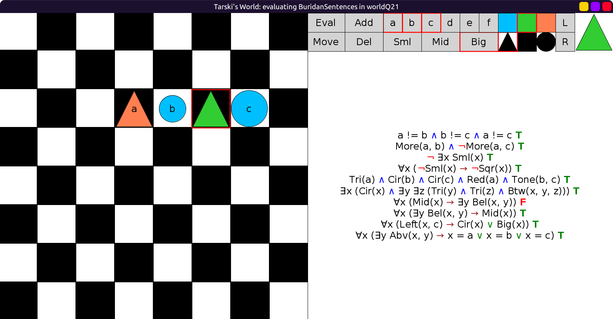
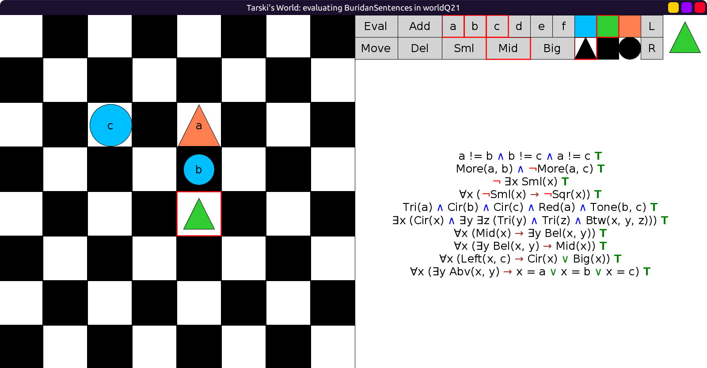

# 21 - solution

One possible solution:

```scala
val worldQ21: Grid = Map(
  (2, 2) -> Block(Big, Cir, Blu, "c"),
  (2, 4) -> Block(Big, Tri, Red, "a"),
  (3, 4) -> Block(Mid, Cir, Blu, "b"),
  (4, 4) -> Block(Mid, Tri, Lim)
)
```

Gradually satisfying the sentences:

1. To satisfy the first sentence, add three unequal blocks:

    

2. To satisfy the second sentence, change the sizes accordingly:

    

3. To satisfy the third sentence, make sure no block is small:

    

4. To satisfy the fourth sentence, make sure there are no squares:

    

5. To satisfy the fifth sentence, make `a` red:

    

6. To satisfy the sixth sentence, add a triangle so that `b` is between two triangles:

    

7. Now all but the seventh sentence are satisfied.
  To satisfy the seventh sentence without breaking the other sentences,
  make the unnamed triangle mid-sized, move `c` to the left and
  arrange `a`-`b`-triangle vertically instead:

    
