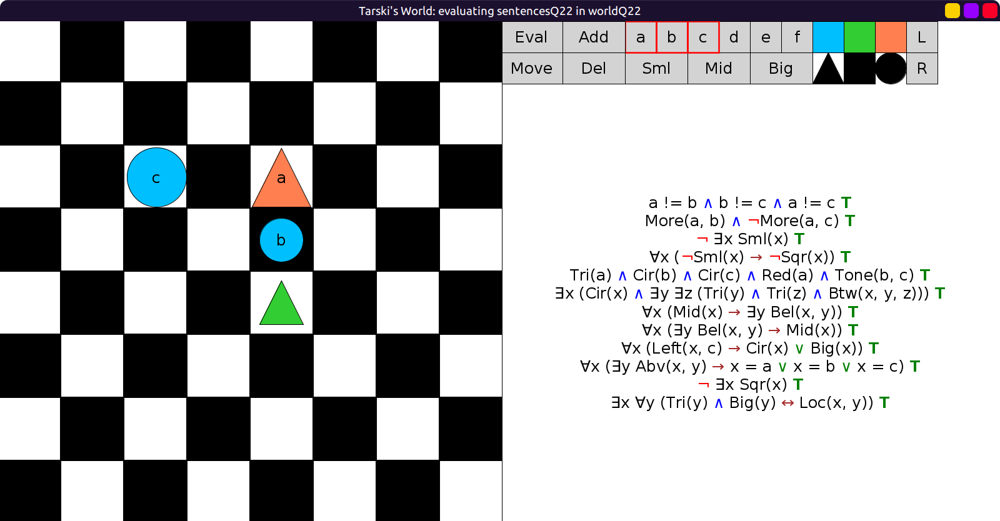
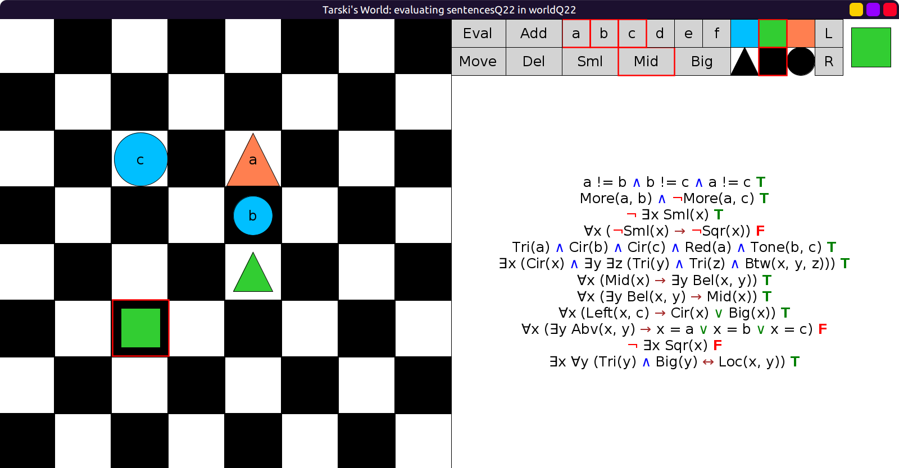
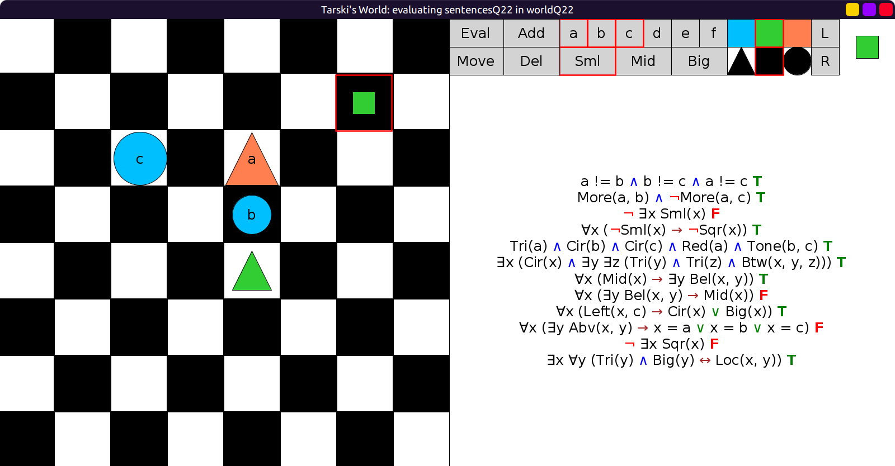
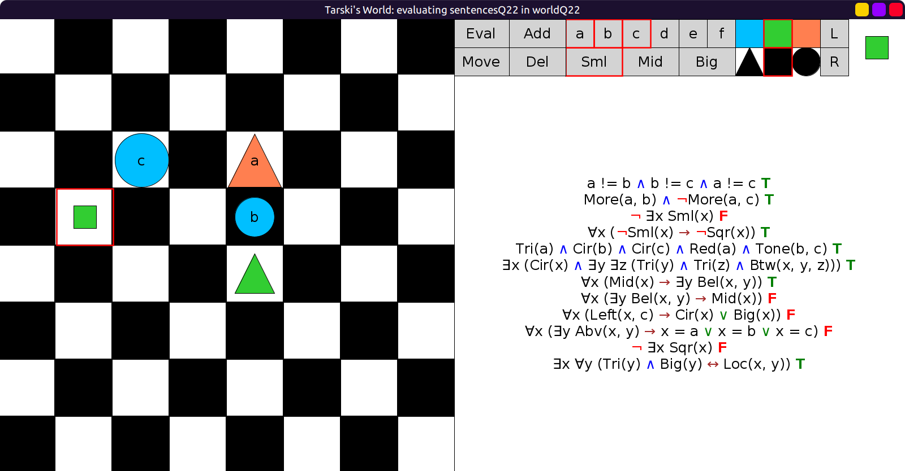
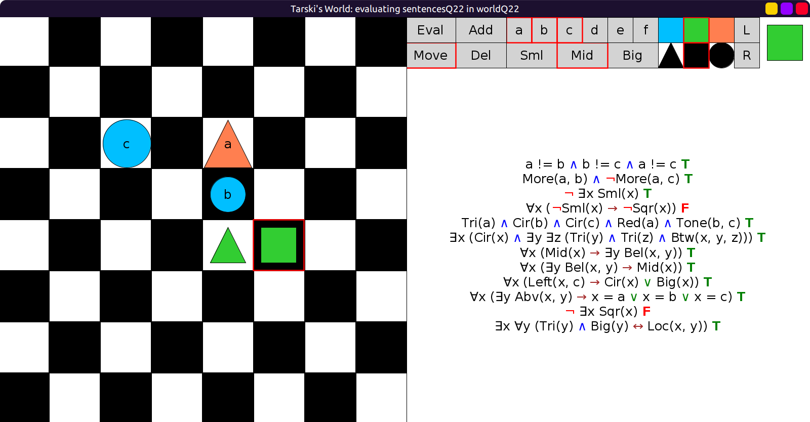
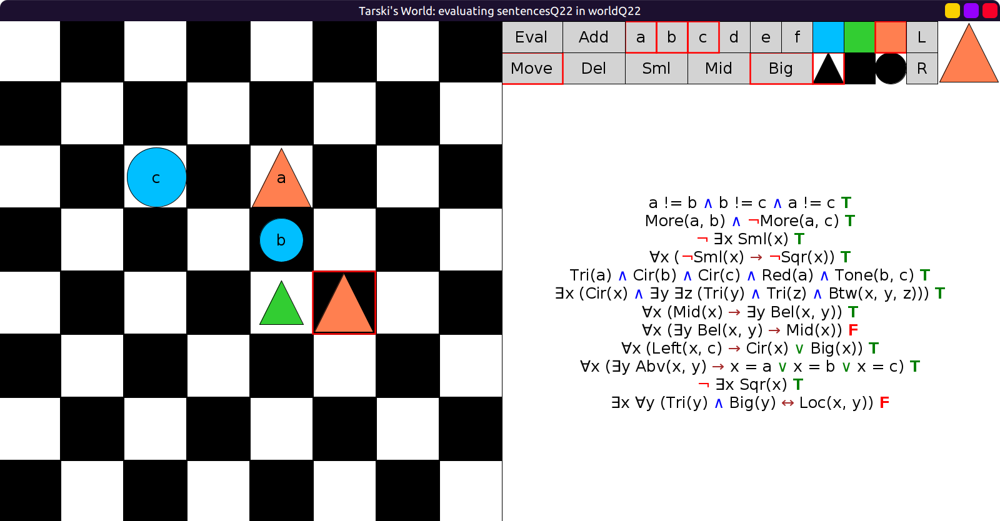

# 22 - solution

Here are the translation of the two sentences:

```scala
val twoSentencesQ22 = Seq(
  fof"¬ ∃x Sqr(x)",
  fof"∃x ∀y ((Tri(y) ∧ Big(y)) ↔ Loc(x, y))"
)
```

Initial evaluation in the world taken from the solution to the previous example:



Now we add a square.
Here are a few different positions and sizes of the square added.

Sentences 4 and 10 are false:



Sentences 3, 8 and 10 are false:



Sentences 3, 8, 9 and 10 are false:



Here only sentence 4 is false:



Here we deleted the square and added another big triangle where
only one of the original ten sentences in `BuridanSentences` is false:


