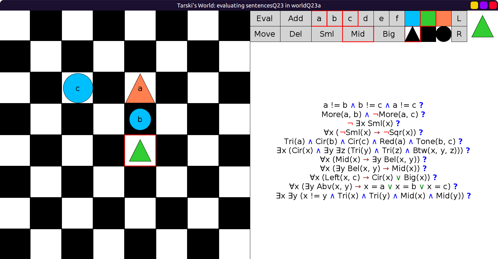
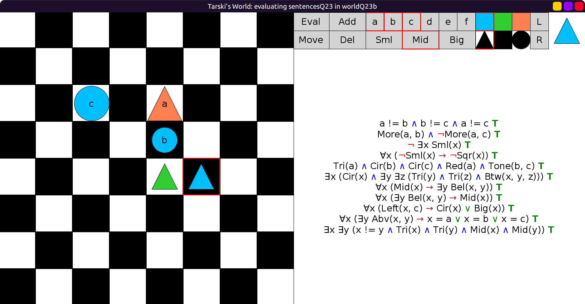

# 23 - solution

We can cheat and copy the solution from Example Q21.

```scala
// this is the same as the starting state of worldQ22:
val worldQ23a: Grid = Map(
  (2, 2) -> Block(Big, Cir, Blu, "c"),
  (2, 4) -> Block(Big, Tri, Red, "a"),
  (3, 4) -> Block(Mid, Cir, Blu, "b"),
  (4, 4) -> Block(Mid, Tri, Lim)
)
```

Luckily in this world, all `BuridanSentences` are true and the new sentence is false:



Then just add one more mid-sized triangle, but of a different tone.
This makes the final sentence true:

```scala
val worldQ23b: Grid = Map(
  (2, 2) -> Block(Big, Cir, Blu, "c"),
  (2, 4) -> Block(Big, Tri, Red, "a"),
  (3, 4) -> Block(Mid, Cir, Blu, "b"),
  (4, 4) -> Block(Mid, Tri, Lim),
  (4, 5) -> Block(Mid, Tri, Blu)
)
```


