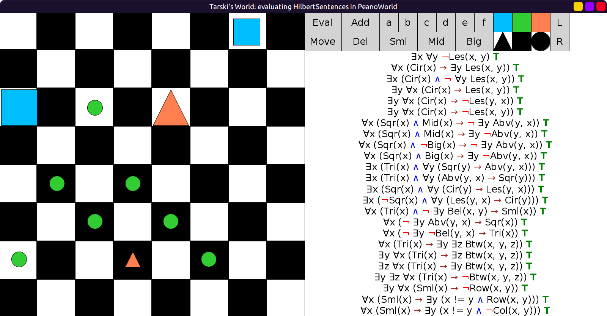

# 24 - solution

Initial evaluation:


The false sentences are:

- ∃x ∀y Les(x, y)
  - This is false because it says that there is a block smaller than all blocks.
  - This can never be true in *any world* because
    - "all blocks" i.e. the y in ∀y also includes the specific block x in ∃x and
    - a block cannot be smaller than itself.
  - We can add a negation sign in front of Les(x, y) to make this true.
    - Now the existential is satisfied by either one of the two big blocks:
      - at (2, 0) or
      - at (2, 4).
- ∃x (Cir(x) ∧ ∀y Les(x, y))
  - This is false because it says there is a circle smaller than all blocks.
  - Similar to the previous sentence, it can never be true in any world.
  - We have to add a negation to ∀y Les(x, y).
  - Now the existential is satisfied by any one of the circles.
- ∃y ∀x (Cir(x) → Les(y, x))
  - False because it says there is a block smaller than all circles.
  - All the circles in `PeanoWorld` are small, so we have to negate Les(y, x).
  - Now the existential is satisfied by any block.
  - If we try to negate Cir(x) instead,
    now it says there is a block smaller than all non-circles.
    But this cannot be satisfied due to the small triangle at (6, 3).
- ∀x ((Sqr(x) ∧ Big(x)) → ¬ ∃y Abv(y, x))
  - False because it says every big square has nothing above it.
  - In `PeanoWorld` the big square at (2, 0) has a mid square above it at (0, 6).
  - Notice that mid square is at the top, so there is nothing above it.
  - We can negate Big(x), now the only x satisfying it is the mid square.
  - And there is nothing above it, so the whole sentence is true.
- ∃x (Sqr(x) ∧ ∀y (Les(y, x) → Cir(y)))
  - False because it says that there is a square such that
    everything smaller than it must be a circle.
  - However there is a small triangle near the bottom at (6, 3)
    and the only two squares are mid or big.
  - We can negate Sqr(x) to make this true.
  - Now the existential is satisfied by any one of the small blocks.
  - However, this way the ∀y (Les(y, x) → Cir(y)) part is only vacuously true.
  - Can it be made nonvacuously true?
  - No, because if we try to satisfy the existential with a mid or big block,
    the small triangle at (6, 3) is a counterexample to the universal.
- ∀x ((Tri(x) ∧ ∃y Bel(x, y)) → Sml(x))
  - False because it says every triangle that is below something must be small.
  - The big triangle at (2, 4) is a counterexample.
    - It is below the mid square at (0, 6) but it's not small.
  - You can try placing the negation directly in front of any atomic sentence,
    Tri(x) or Bel(x, y) or Sml(x), but it does not work.
  - We can negate ∃y Bel(x, y) instead, and now it is true.
  - Now it says every triangle that is not below something must be small.
  - But this is vacuously true! Could it be nonvacuously true?
    - No, because the only block that is not below something is the mid square at (0, 6).
  - What if we negate the whole expression (Tri(x) ∧ ∃y Bel(x, y))?
    - This does not work either.
- ∀x (¬ ∃y Bel(y, x) → Tri(x))
  - False because it says every block with nothing below it is a triangle.
  - The two circles at (6, 0) and (6, 5) are counterexamples.
  - Negating Tri(x) won't work because of the triangle at (6, 3).
  - If we negate Bel(y, x) it becomes true.
- ∃y ∃z ∀x (Tri(x) → Btw(x, y, z))
  - False because it says there are two blocks such that all triangles are between them.
  - Can be made true by negating Btw(x, y, z).
- ∃y ∀x (Sml(x) → Row(x, y))
  - False because it says there is a block that is on the same row as every small block.
  - Negating Sml(x) does not work since there are mid and big blocks on different rows.
  - We have to negate Row(x, y).
- ∀x (Sml(x) → ∃y (¬Loc(x, y) ∧ Col(x, y)))
  - False because it says every small block has something else on the same column.
  - The small circle at (4, 1) is a counterexample.
    - There are no other blocks on that column.
  - Negating Sml(x) does not work because of the mid square at (0, 6),
    which also has no other block on its column.
  - We have to negate Col(x, y).

Here are the corrected sentences, all true:

```scala
val HilbertSentences = Seq(
  fof"∃x ∀y ¬ Les(x, y)", // changed
  fof"∀x (Cir(x) → ∃y Les(x, y))",
  fof"∃x (Cir(x) ∧ ¬ ∀y Les(x, y))", // changed
  fof"∃y ∀x (Cir(x) → Les(x, y))",
  fof"∃y ∀x (Cir(x) → ¬Les(y, x))", // changed
  fof"∃y ∀x (Cir(x) → ¬Les(x, y))",
  fof"∀x ((Sqr(x) ∧ Mid(x)) → ¬ ∃y Abv(y, x))",
  fof"∀x ((Sqr(x) ∧ Mid(x)) → ∃y ¬Abv(y, x))",
  fof"∀x ((Sqr(x) ∧ ¬Big(x)) → ¬ ∃y Abv(y, x))", // changed
  fof"∀x ((Sqr(x) ∧ Big(x)) → ∃y ¬Abv(y, x))",
  fof"∃x (Tri(x) ∧ ∀y (Sqr(y) → Abv(y, x)))",
  fof"∃x (Tri(x) ∧ ∀y (Abv(y, x) → Sqr(y)))",
  fof"∃x (Sqr(x) ∧ ∀y (Cir(y) → Les(y, x)))",
  fof"∃x (¬Sqr(x) ∧ ∀y (Les(y, x) → Cir(y)))", // changed
  fof"∀x ((Tri(x) ∧ ¬ ∃y Bel(x, y)) → Sml(x))", // changed
  fof"∀x (¬ ∃y Abv(y, x) → Sqr(x))",
  fof"∀x (¬ ∃y ¬Bel(y, x) → Tri(x))", // changed
  fof"∀x (Tri(x) → ∃y ∃z Btw(x, y, z))",
  fof"∃y ∀x (Tri(x) → ∃z Btw(x, y, z))",
  fof"∃z ∀x (Tri(x) → ∃y Btw(x, y, z))",
  fof"∃y ∃z ∀x (Tri(x) → ¬Btw(x, y, z))", // changed
  fof"∃y ∀x (Sml(x) → ¬Row(x, y))", // changed
  fof"∀x (Sml(x) → ∃y (¬Loc(x, y) ∧ Row(x, y)))",
  fof"∀x (Sml(x) → ∃y (¬Loc(x, y) ∧ ¬Col(x, y)))" // changed
)
```

After making these changes, evaluating once more, all true:


