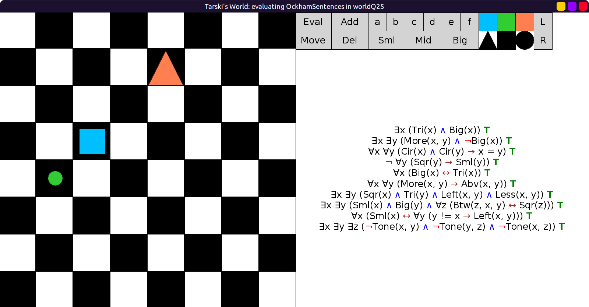

# 25 - solution

Here is one possible solution:

```scala
val worldQ25: Grid = Map(
  (4, 1) -> Block(Sml, Cir, Lim),
  (3, 2) -> Block(Mid, Sqr, Blu),
  (1, 4) -> Block(Big, Tri, Red)
)
```

Evaluation:


