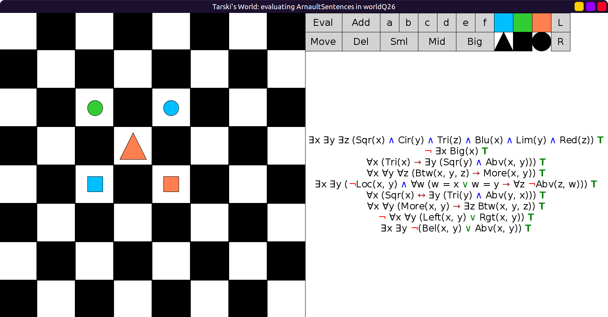

# 26 - solution

Here is one possible solution:

```scala
val worldQ26: Grid = Map(
  (2, 2) -> Block(Sml, Cir, Lim),
  (2, 4) -> Block(Sml, Cir, Blu),
  (3, 3) -> Block(Mid, Tri, Red),
  (4, 2) -> Block(Sml, Sqr, Blu),
  (4, 4) -> Block(Sml, Sqr, Red)
)
```

Evaluation:


