# 27 - solution

Build a world where the first two sentences are both true:

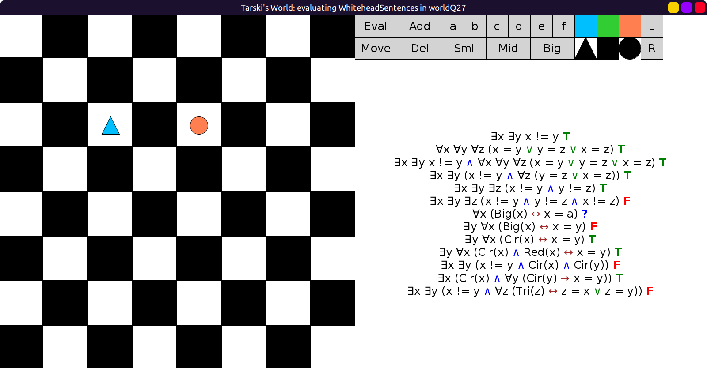

Sentence 3 is also true in the world we have just built.
Sentence 4 is equivalent to 3, so it is also true.

Sentence 5 seems like it says there are at least 3 objects.
But it is still true in the same world, instead of false. Why?
∃x ∃y ∃z (x != y ∧ y != z) says that x and y are non-identical,
and y and z are non-identical, but x and z can still be identical.
So the existentials ∃x and ∃z can be satisfied by the same block.

Sentence 6 is false in the same world because there are only 2 objects.

For sentence 7, start with 3 small objects to play the game committed to true:

```scala
val worldQ27: Grid = Map(
  (2, 2) -> Block(Sml, Tri, Blu),
  (2, 4) -> Block(Sml, Cir, Red),
  (3, 3) -> Block(Sml, Sqr, Lim, "a")
)
```

Tarski's world will choose `a` as its counterexample:

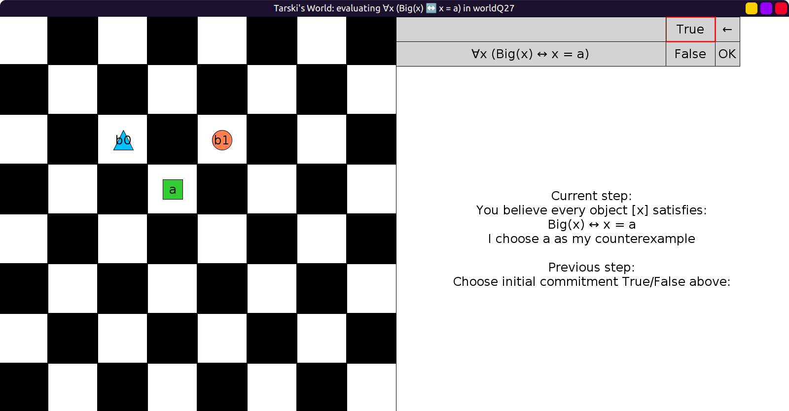

Eventually you have to pick between `a != a` or `Big(a)`:

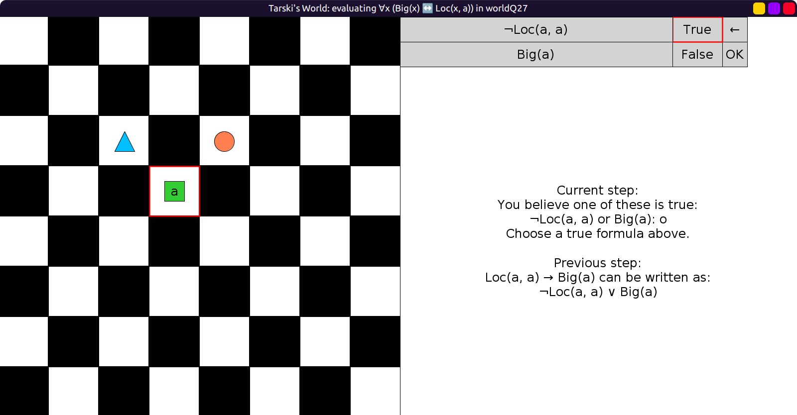

Both are false:

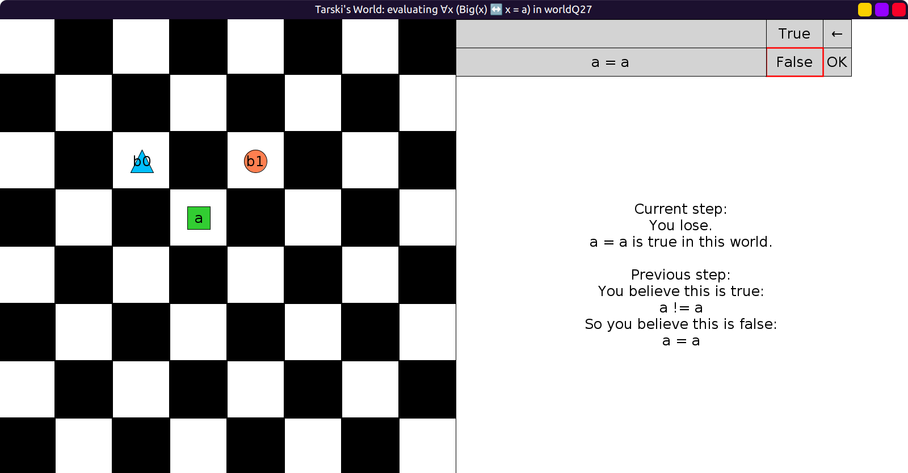


Sentence 8 is only true in worlds with exactly 1 big object.
0 or 2 big objects make it false:

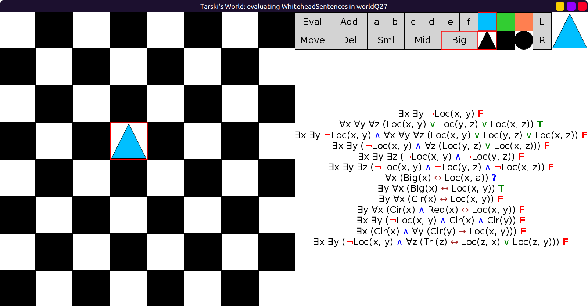

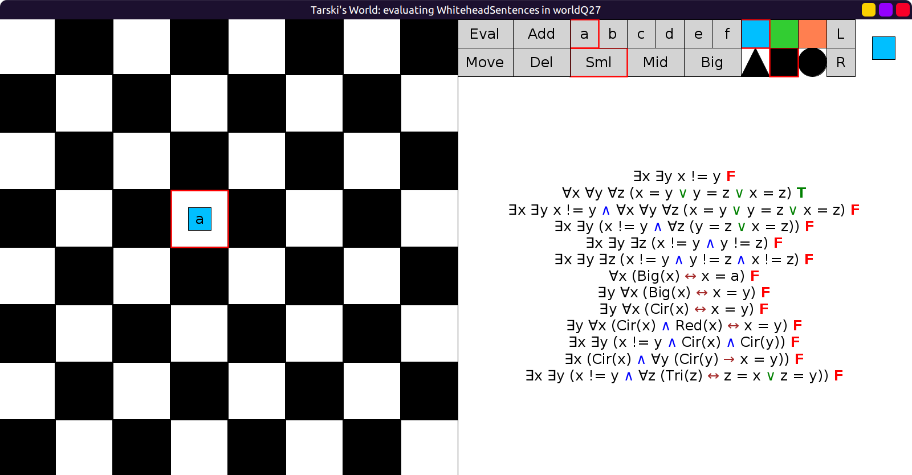

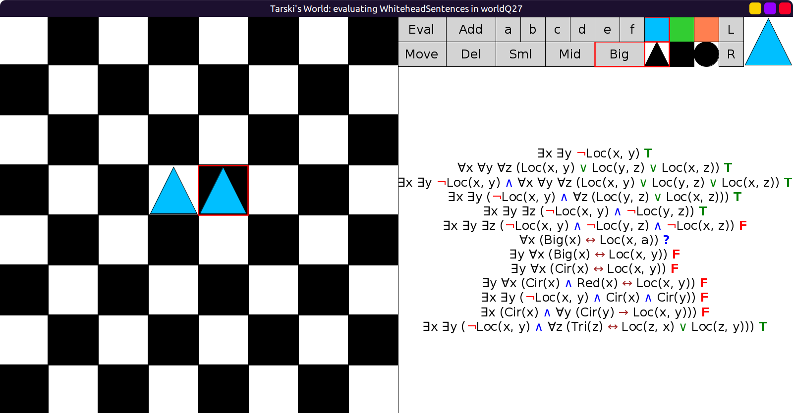

Sentence 9 says there is a unique circle. True in this world:

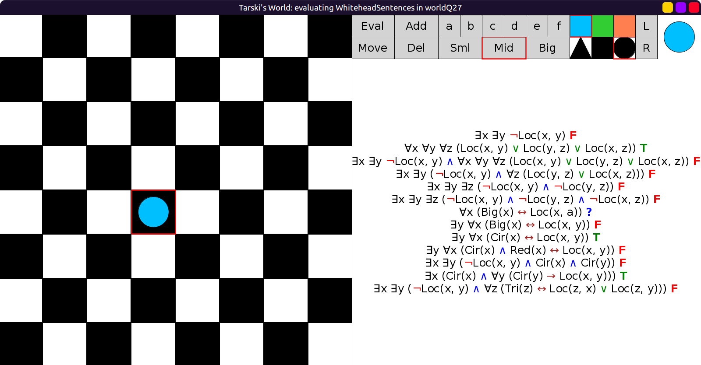

Sentence 10 says there is a unique red circle,
sentence 11 says there are two non-identical circles.
True in this world:

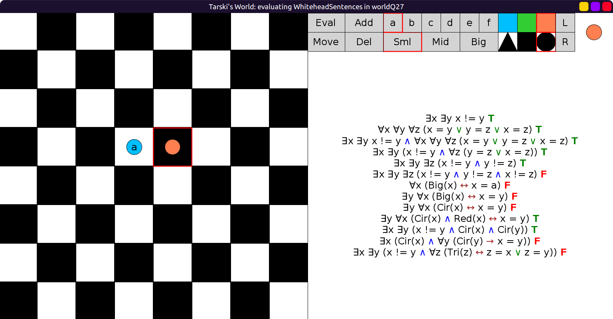

Sentence 12 is also true in the same world as sentence 9 above (unique circle).

Sentence 13, true when there are exactly 2 triangles, false when 1 or 3:

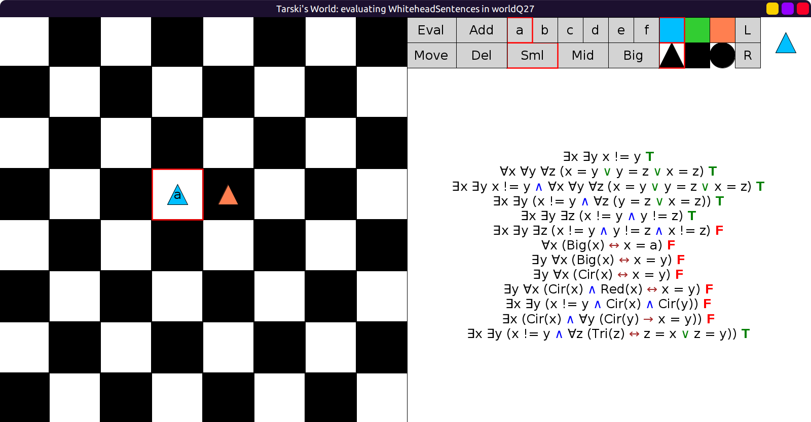

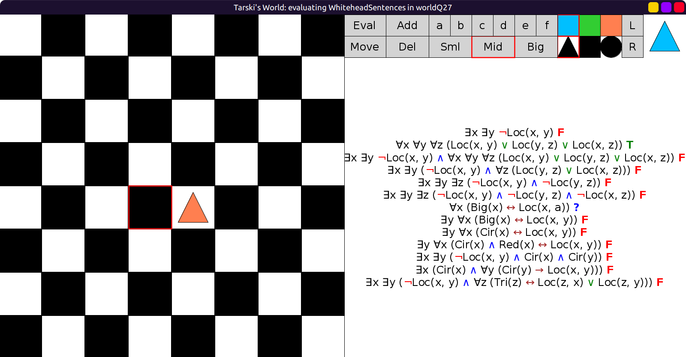

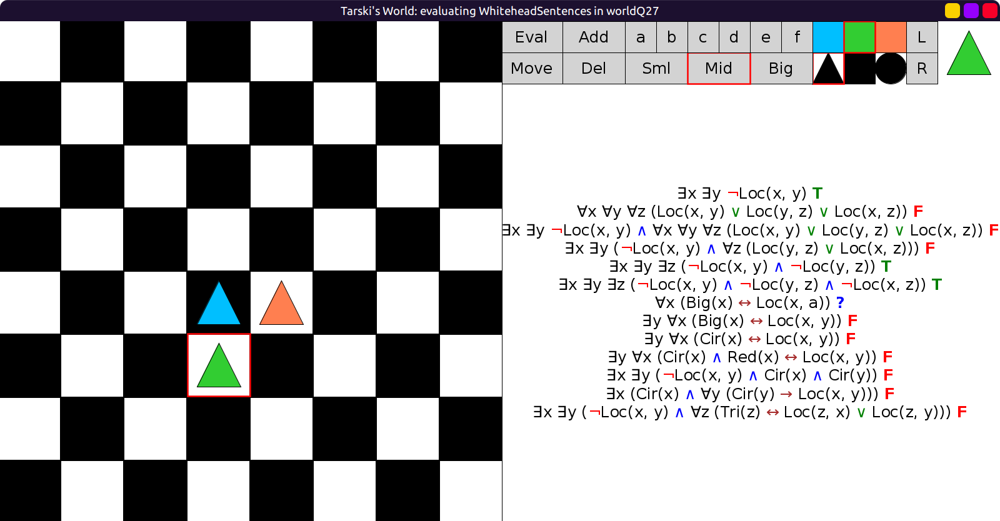
