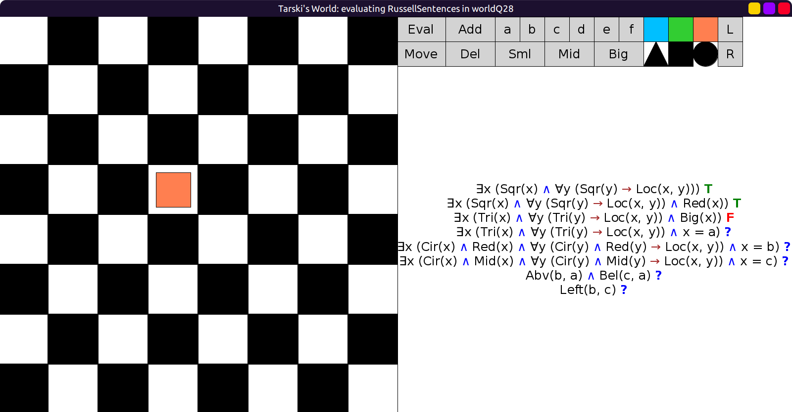
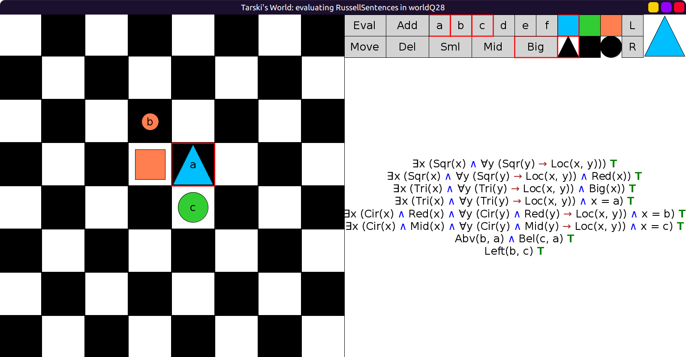

# 28 - solution

If we compare sentences 1 and 2 they say that there is a unique square
and there is a unique red square, respectively.
So in any world where sentence 2 is true, sentence 1 will also be true.

We can construct a world in which sentence 2 is true:

```scala
val worldQ28: Grid = Map(
  (3, 3) -> Block(Mid, Sqr, Red)
)
```



Here is a world in which sentences 2-8 are all true:

```scala
val worldQ28: Grid = Map(
  (2, 3) -> Block(Sml, Cir, Red, "b"),
  (3, 3) -> Block(Mid, Sqr, Red),
  (3, 4) -> Block(Big, Tri, Blu, "a"),
  (4, 4) -> Block(Mid, Cir, Lim, "c")
)
```


