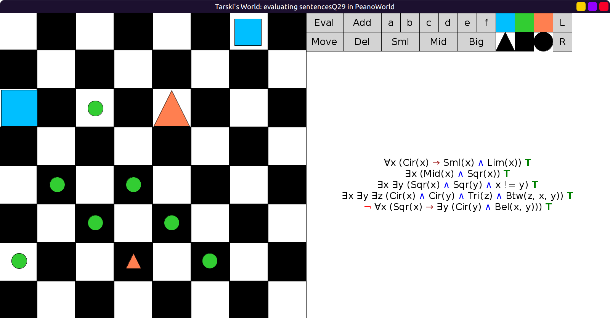
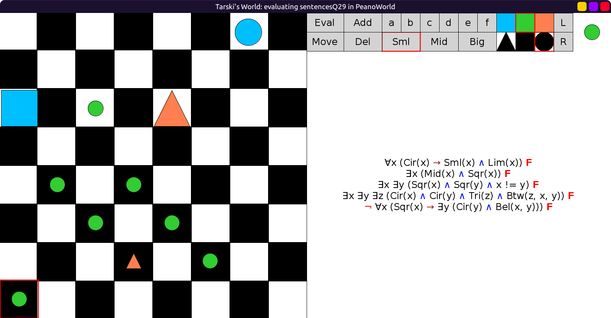

# 29 - solution

```scala
val sentencesQ29 = Seq(
  fof"∀x (Cir(x) → (Sml(x) ∧ Lim(x)))",
  fof"∃x (Mid(x) ∧ Sqr(x))",
  fof"∃x ∃y (Sqr(x) ∧ Sqr(y) ∧ x != y)",
  fof"∃x ∃y ∃z (Cir(x) ∧ Cir(y) ∧ Tri(z) ∧ Btw(z, x, y))",
  fof"¬ ∀x (Sqr(x) → ∃y (Cir(y) ∧ Bel(x, y)))"
)
```

All true:



All false:


