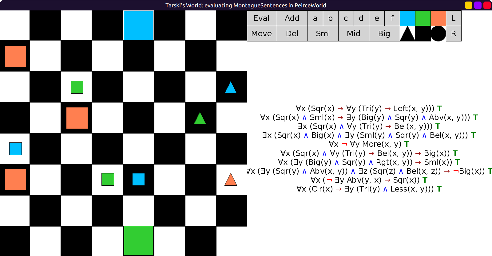
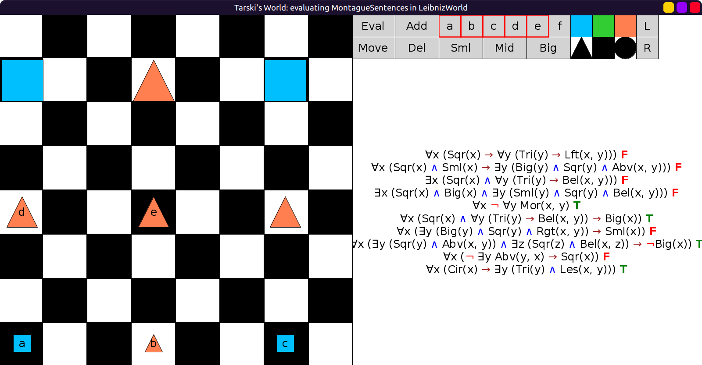
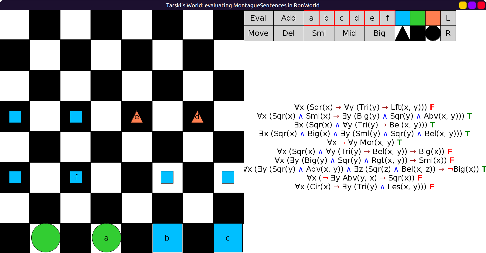

# 30 - solution

```scala
val MontagueSentences = Seq(
  fof"∀x (Sqr(x) → ∀y (Tri(y) → Left(x, y)))",
  fof"∀x ((Sqr(x) ∧ Sml(x)) → ∃y (Big(y) ∧ Sqr(y) ∧ Abv(x, y)))",
  fof"∃x (Sqr(x) ∧ ∀y (Tri(y) → Bel(x, y)))",
  fof"∃x (Sqr(x) ∧ Big(x) ∧ ∃y (Sml(y) ∧ Sqr(y) ∧ Bel(x, y)))",
  fof"∀x (¬ ∀y Mor(x, y))",
  fof"∀x ((Sqr(x) ∧ ∀y (Tri(y) → Bel(x, y))) → Big(x))",
  fof"∀x (∃y (Big(y) ∧ Sqr(y) ∧ Rgt(x, y)) → Sml(x))",
  fof"∀x ((∃y (Sqr(y) ∧ Abv(x, y)) ∧ ∃z (Sqr(z) ∧ Bel(x, z))) → ¬Big(x))",
  fof"∀x (¬ ∃y Abv(y, x) → Sqr(x))",
  fof"∀x (Cir(x) → ∃y (Tri(y) ∧ Les(x, y)))"
)
```

All true in `PeirceWorld`:



5, 6, 8, 10 true, the rest false in `LeibnizWorld`:



2, 3, 4, 5, 8 true, the rest false in `RonWorld`:


