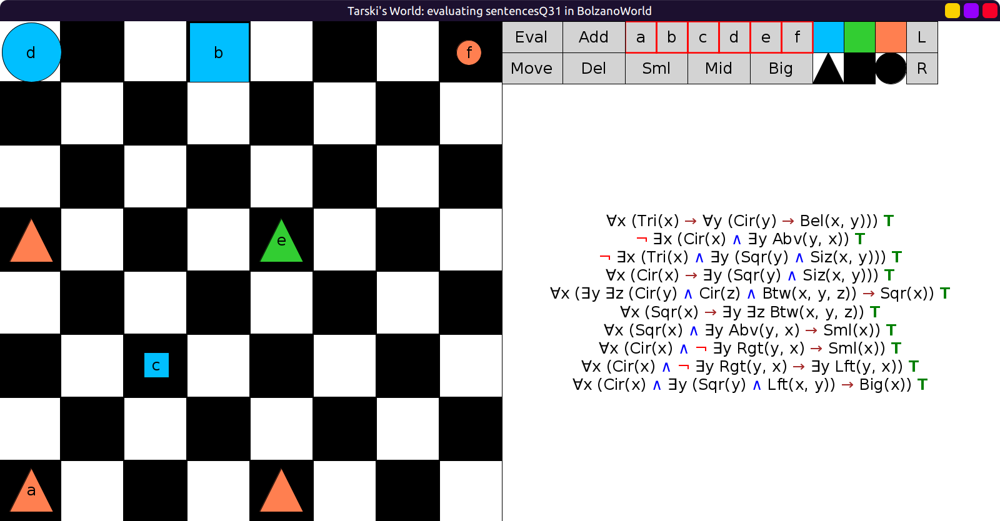
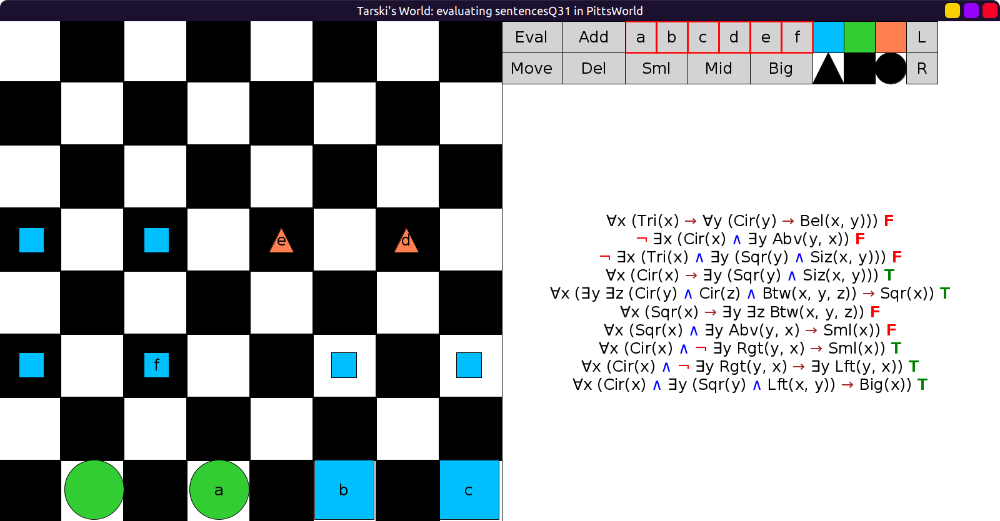
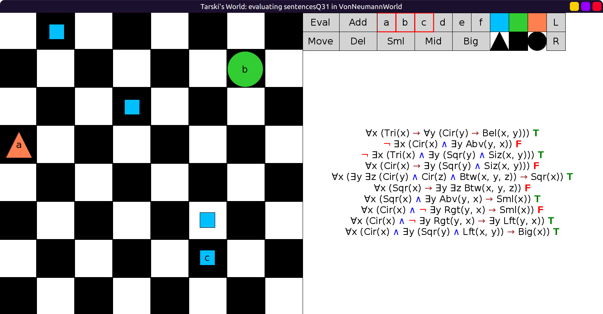
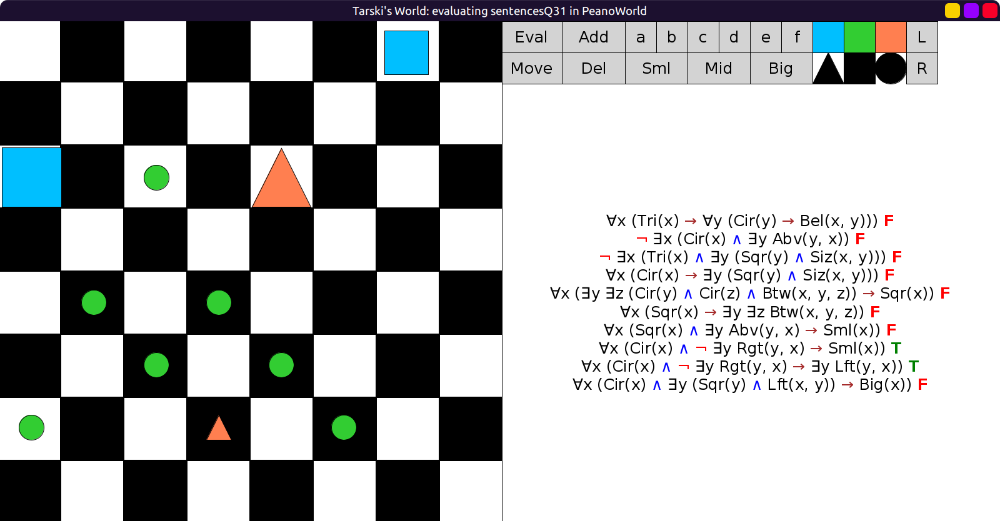

# 31 - solution

I translated "no circle", "no triangle" and "nothing" naturally
as `¬ ∃x` but it could also be translated as `∀x` if you want.

```scala
val sentencesQ31 = Seq(
  fof"∀x (Tri(x) → ∀y (Cir(y) → Bel(x, y)))",                // Every triangle is below every circle.
  fof"¬ ∃x (Cir(x) ∧ ∃y Abv(y, x))",                         // No circle has anything above it.
  fof"¬ ∃x (Tri(x) ∧ ∃y (Sqr(y) ∧ Siz(x, y)))",              // No triangle is the same size as any square.
  fof"∀x (Cir(x) → ∃y (Sqr(y) ∧ Siz(x, y)))",                // Every circle is the same size as some square.
  fof"∀x (∃y ∃z (Cir(y) ∧ Cir(z) ∧ Btw(x, y, z)) → Sqr(x))", // Anything between two circles is a square.
  fof"∀x (Sqr(x) → ∃y ∃z Btw(x, y, z))",                     // Every square falls between two objects.
  fof"∀x (Sqr(x) ∧ ∃y Abv(y, x) → Sml(x))",                  // Every square with something above it is small.
  fof"∀x (Cir(x) ∧ ¬ ∃y Rgt(y, x) → Sml(x))",                // Every circle with nothing to its right is small.
  fof"∀x (Cir(x) ∧ ¬ ∃y Rgt(y, x) → ∃y Lft(y, x))", // Every circle with nothing to its right has something to its left.
  fof"∀x (Cir(x) ∧ ∃y (Sqr(y) ∧ Lft(x, y)) → Big(x))" // Any circle to the left of a square is big.
)
```

`BolzanoWorld`, all true:



`PittsWorld`, 4, 5, 8, 9, and 10 are true:



`VonNeumannWorld`, 1, 3, 5, 7, 9, 10 true:



`PeanoWorld`, 8 and 9 true:


