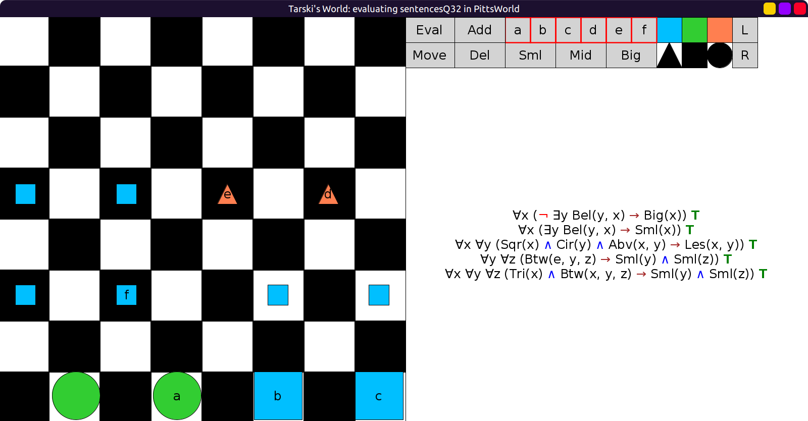
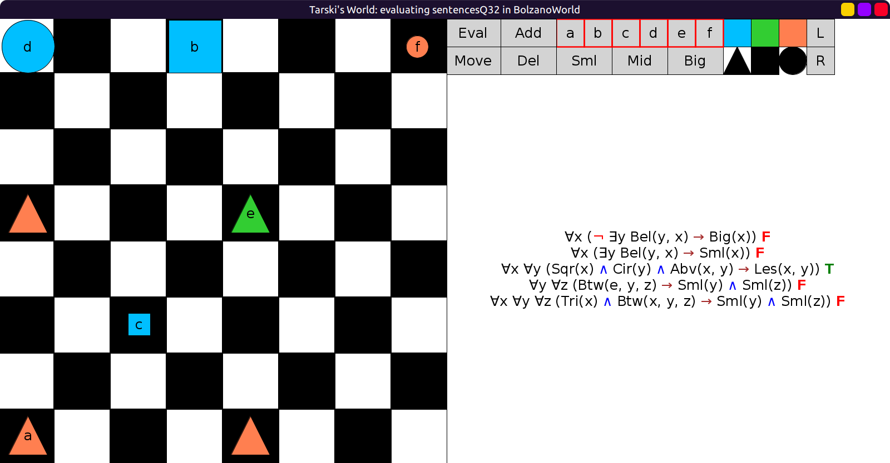
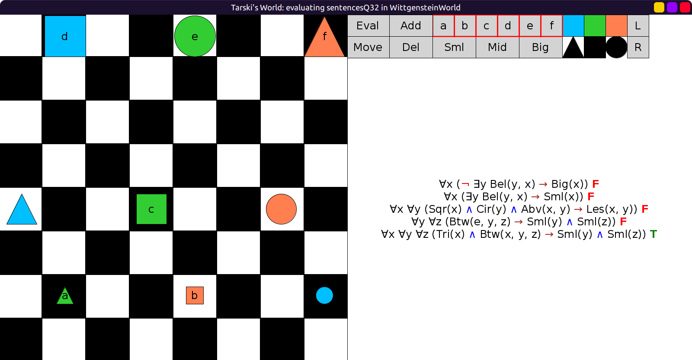

# 32 - solution

1. Only big objects have nothing below them.

    - Paraphrase: Every object with nothing below it is big.
    - Procedure: ∀x (x-has-nothing-below-it → x-is-big)

2. If a square has something below it, then it's small.

    - Paraphrase: Every square that has something below it is small.
    - Procedure: ∀x (x-has-something-below-it → x-is-small)

3. Every square above a circle is also smaller than it.

    These donkey sentences are quite hard and confusing.
    At first glance it seems like it should be of the form: ∀x (∃y (...) → ...)
    because the "a" in "a circle" suggests an existential quantifier;
    like "for every square, if there exists a circle such that ..., then ...".
    The issue is that, with this translation, the circle that exists in the
    antecedent ∃y (...) has to be referred again in the consequent ...,
    but we can't express that the circle in the consequent is *THE* special
    circle that exists in the antecedent.
    So we use a universal quantifier for the circle as well.

    - Paraphrase: For every square and every circle,
      if the square is above the circle, then the square is smaller than the circle.
    - Procedure: ∀x ∀y (x-is-sqr ∧ y-is-cir ∧ x-is-above-y → x-is-smaller-than-y)

4. If `e` is between two objects, then they are both small.

    Similarly this is a donkey sentence.

    - Paraphrase: For every two objects, if `e` is between the two objects,
      then the two objects are both small.
    - Procedure: ∀y ∀z (e-is-between-y-and-z → y-and-z-are-both-small)

5. If a triangle is between two objects, then they are both small.

    This is a version of the previous with an additional quantifier.

    - Paraphrase: For every triangle and every two objects, if the triangle
      is between the two objects, then the two objects are both small.
    - Procedure: ∀x ∀y ∀z (x-is-tri ∧ x-is-between-y-and-z → y-and-z-are-both-small)

So we have the following translations:

```scala
val sentencesQ32 = Seq(
  fof"∀x (¬ ∃y Bel(y, x) → Big(x))",
  fof"∀x (∃y Bel(y, x) → Sml(x))",
  fof"∀x ∀y (Sqr(x) ∧ Cir(y) ∧ Abv(x, y) → Les(x, y))",
  fof"∀y ∀z (Btw(e, y, z) → (Sml(y) ∧ Sml(z)))",
  fof"∀x ∀y ∀z (Tri(x) ∧ Btw(x, y, z) → (Sml(y) ∧ Sml(z)))"
)
```

All 5 true in `PittsWorld`:



Only 3 true in `BolzanoWorld`:



Only 5 true in `WittgensteinWorld`:


