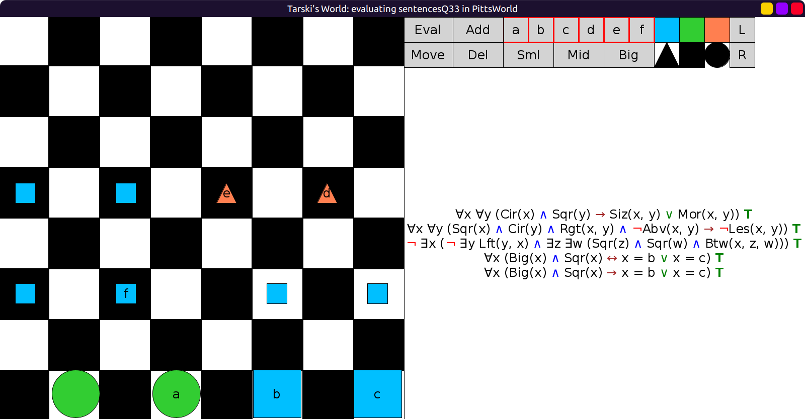
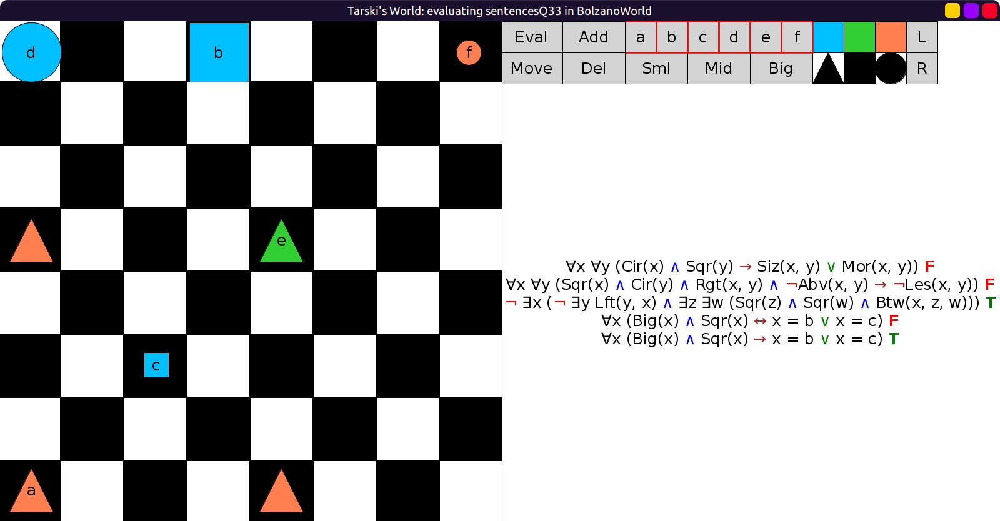
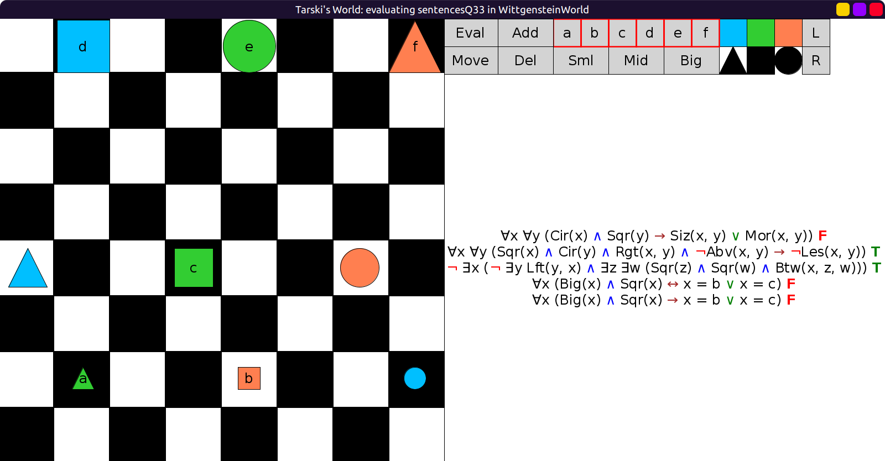

# 33 - solution

```scala
val sentencesQ33 = Seq(
  fof"∀x ∀y (Cir(x) ∧ Sqr(y) → (Siz(x, y) ∨ Mor(x, y)))",
  fof"∀x ∀y (Sqr(x) ∧ Cir(y) ∧ Rgt(x, y) ∧ ¬Abv(x, y) → ¬Les(x, y))",
  fof"¬ ∃x (¬ ∃y Lft(y, x) ∧ (∃z ∃w (Sqr(z) ∧ Sqr(w) ∧ Btw(x, z, w))))",
  fof"∀x ((Big(x) ∧ Sqr(x)) ↔ (x = b ∨ x = c))",
  fof"∀x ((Big(x) ∧ Sqr(x)) → (x = b ∨ x = c))"
)
```

All true in `PittsWorld`:



Only 3 and 5 true in `BolzanoWorld`:



Only 2 and 3 true in `WittgensteinWorld`:


