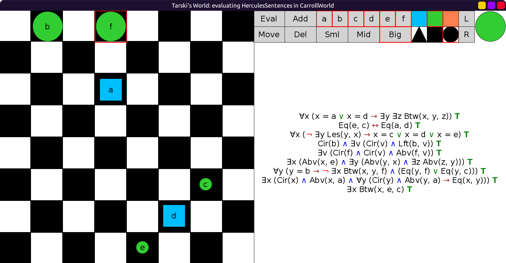

# 34 - solution

```scala
val CarrollWorld: Grid = Map(
  (0, 1) -> Block(Big, Cir, Lim, "b"),
  (0, 3) -> Block(Big, Cir, Lim, "f"),
  (2, 3) -> Block(Mid, Sqr, Blu, "a"),
  (5, 6) -> Block(Sml, Cir, Lim, "c"),
  (6, 5) -> Block(Mid, Sqr, Blu, "d"),
  (7, 4) -> Block(Sml, Cir, Lim, "e")
)
```


