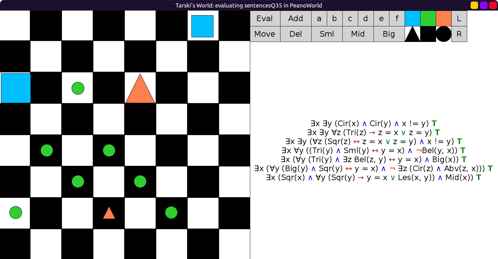
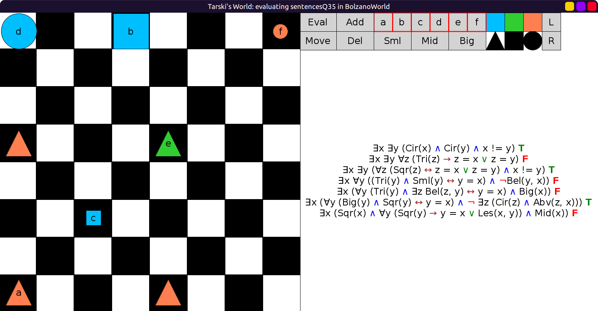
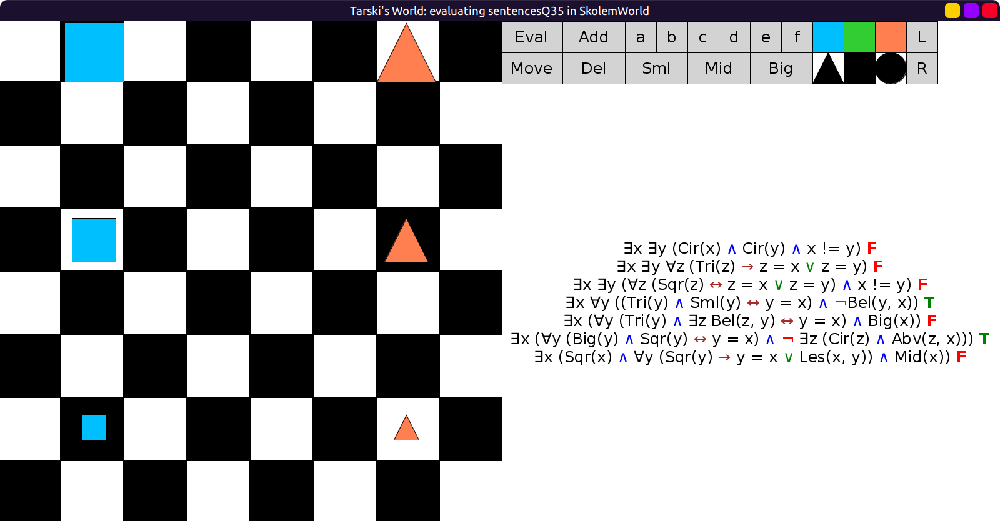
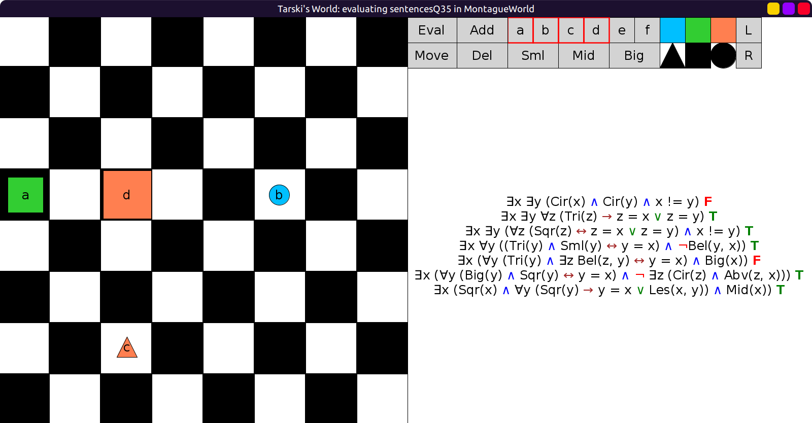

# 35 - solution

```scala
val sentencesQ35 = Seq(
  fof"∃x ∃y (Cir(x) ∧ Cir(y) ∧ x != y)",                              // at least 2 circles
  fof"∃x ∃y ∀z (Tri(z) → (z = x ∨ z = y))",                           // at most 2 triangles
  fof"∃x ∃y (∀z (Sqr(z) ↔ (z = x ∨ z = y)) ∧ x != y)",                // exactly 2 squares
  fof"∃x ∀y ((Tri(y) ∧ Sml(y) ↔ y = x) ∧ ¬Bel(y, x))",                // The small triangle has nothing below it
  fof"∃x (∀y (Tri(y) ∧ ∃z Bel(z, y) ↔ y = x) ∧ Big(x))",              // The triangle with something below it is big
  fof"∃x (∀y (Big(y) ∧ Sqr(y) ↔ y = x) ∧ ¬ ∃z (Cir(z) ∧ Abv(z, x)))", // No circle is above the big square
  fof"∃x (Sqr(x) ∧ ∀y (Sqr(y) → (y = x ∨ Les(x, y))) ∧ Mid(x))"       // The smallest square is medium
)
```

All true in `PeanoWorld`



1,3,6 true in `BolzanoWorld`



4, 6 true in `SkolemWorld`



2, 3, 4, 6, 7 in `MontagueWorld`



Saying "the smallest square" is a bit tricky; I chose to say "x is a square" (`Sqr(x)`)
and "if y is a square, y is x or x is smaller than y" (`Sqr(y) → (y = x ∨ Les(x, y))`).
The uniqueness of THE smallest square `x` is implied, since `Les(x, y)` forces `x != y`.
If we wrote it out the long way, even with the `↔` shortcut, it would look like:

∃x (x-is-the-smallest-square ∧ Mid(x))

∃x (∀y (y-is-the-smallest-square ↔ y = x) ∧ Mid(x))

∃x (∀y ((Sqr(y) ∧ y-is-smaller-than-all-other-squares) ↔ y = x) ∧ Mid(x))

∃x (∀y ((Sqr(y) ∧ ∀z (Sqr(z) ∧ y != z → Les(y, z))) ↔ y = x) ∧ Mid(x))

## Optional sentences

- There are only 3 things that are not small:

∃x ∃y ∃z (x != y ∧ x != z ∧ y != z ∧ ∀v (¬Sml(v) ↔ (v = x ∨ v = y ∨ v = z)))

- The medium square is to the right of the big square:

∃x ∃y ∀z ((Mid(z) ∧ Sqr(z) ↔ z = x) ∧ (Big(z) ∧ Sqr(z) ↔ z = y) ∧ Rgt(x, y))

- The only thing with nothing to its right is the medium square:

∃x ∃y ∀z ((¬ ∃v Rgt(v, z) ↔ z = x) ∧ (Mid(z) ∧ Sqr(z) ↔ z = y) ∧ x = y)
