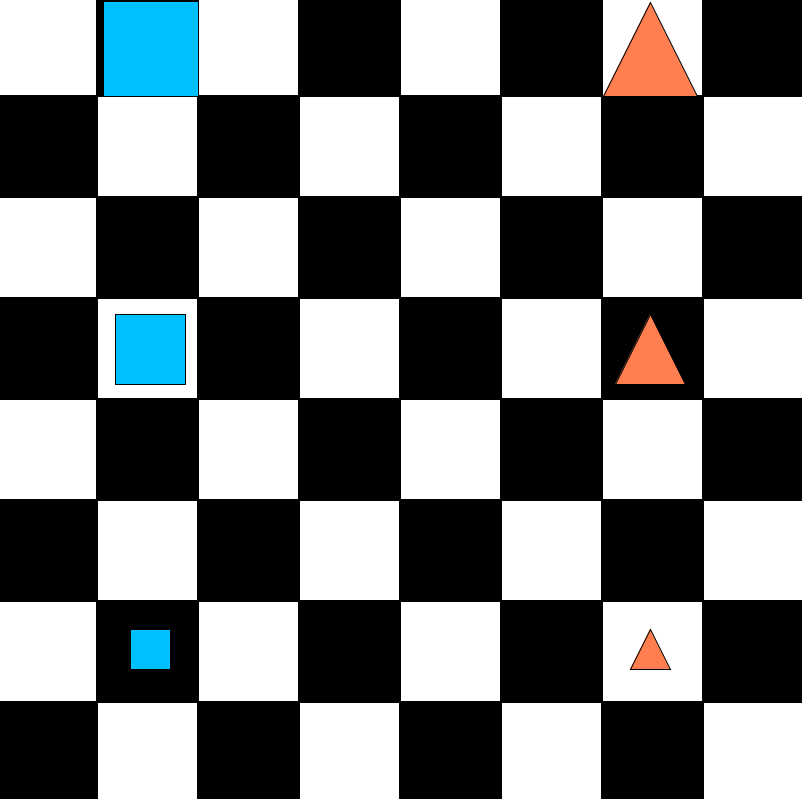

# 36 - Saying more complicated things

- See this picture of `SkolemWorld`:

  

- Describe the following features of `SkolemWorld` in `sentencesQ36`.

1. Use your first sentence to say that there are only blue squares and red triangles.
2. Next say that there are exactly two mid blocks and that they are on the same row.
3. Say that every square is on the same column as any square
  and is on a different column than any triangle.
4. Express the fact that every square has a triangle
  that is to its right but is neither below or above it.
5. Express the fact that at least one of the triangles is between two other triangles.
6. Notice that the further back something is, the bigger it is. Say this.
7. Say that none of the squares is to the left or right of any of the other squares.
8. Say the same red blocks.
9. Say that every triangle has a square of
  the same size and different tone on the same row.

- If you have expressed yourself correctly,
  there is very little you can do to `SkolemWorld`
  without making at least one of your sentences false.
- Basically, all you can do is "stretch" things out, that is,
  move things apart while keeping them aligned.
- To see this, try making the following changes.

1. Add a new big red triangle to the top row.
2. Find one of your sentences that comes out false.
3. Move the new triangle so that different sentences come out false.
4. Remove the new triangle.
  Change the size of one of the objects.
  What sentences now come out false?
5. Change the size back to what it was.
  Now change the shape of one of the objects.
  What sentences come out false?
6. Change the shape back to what it was.
  Now slide one of the squares to the left.
  What sentences come out false?
7. Rearrange the three squares in their initial positions.
  Meaning, swap their places with each other so they are not on their starting positions.
  What goes wrong now?

## Optional sentences

State these, but not in `sentencesQ36`, just on paper by hand. They are long sentences.

1. There are exactly three red blocks.

2. The small triangle is below but to neither side of all the other triangles.
