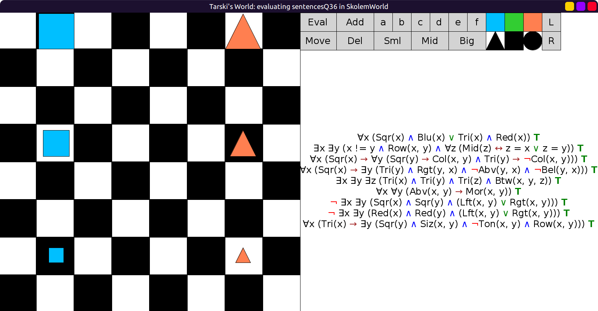
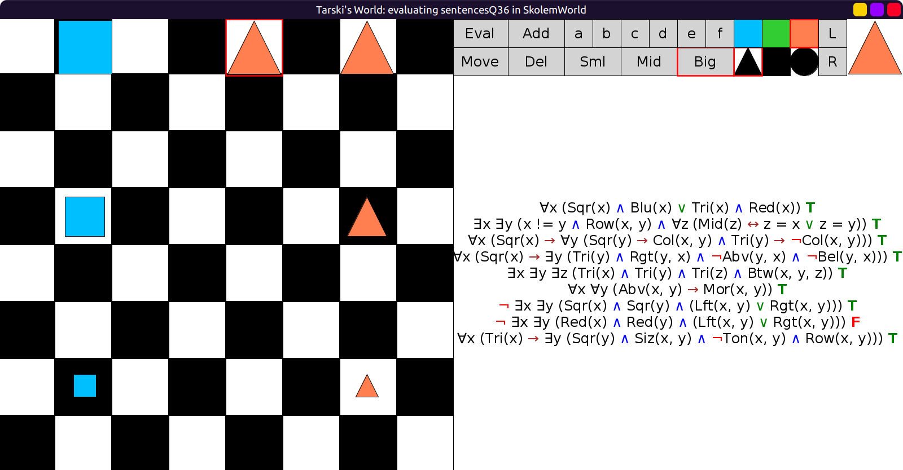
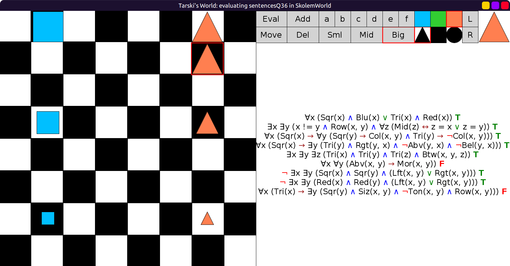
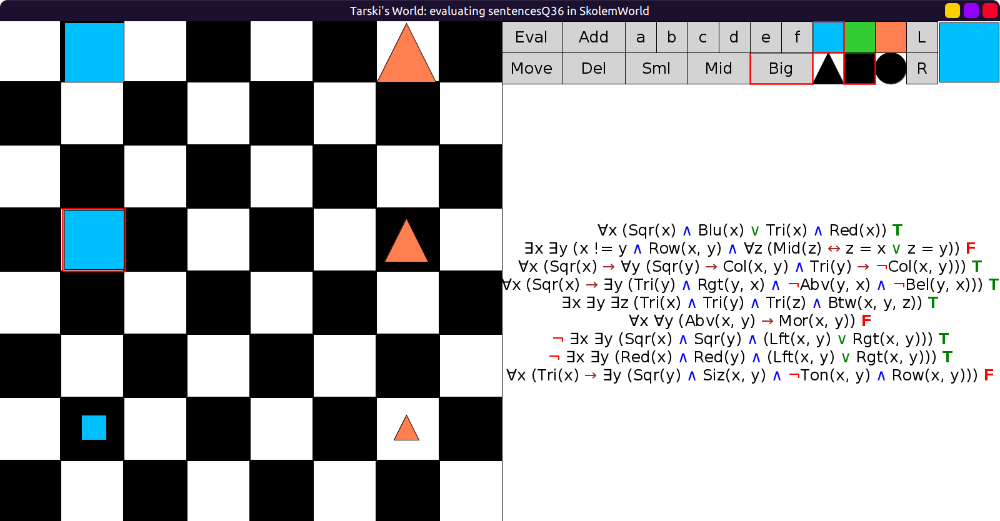
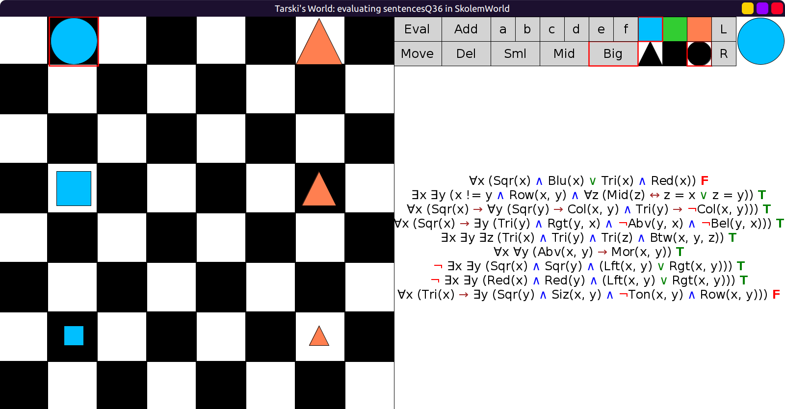
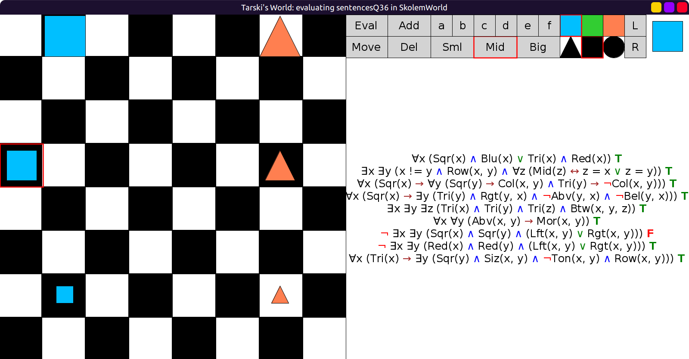
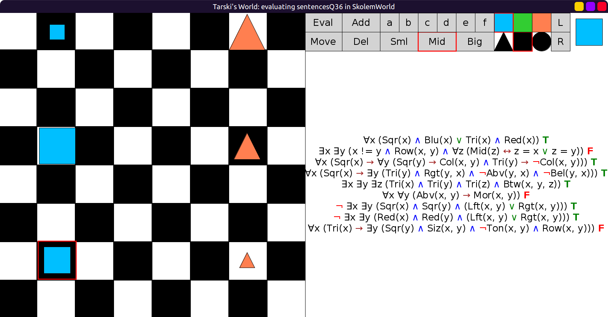

# 36 - solution

```scala
val sentencesQ36 = Seq(
  fof"∀x (Sqr(x) ∧ Blu(x) ∨ Tri(x) ∧ Red(x))",                   // there are only blue squares and red triangles
  fof"∃x ∃y (x != y ∧ Row(x, y) ∧ ∀z (Mid(z) ↔ z = x ∨ z = y))", // there are exactly two mid blocks, on the same row
  fof"∀x (Sqr(x) → ∀y (Sqr(y) → Col(x, y) ∧ Tri(y) → ¬Col(x, y)))", // every square is on the same col as any square and on a different col than any triangle
  fof"∀x (Sqr(x) → ∃y (Tri(y) ∧ Rgt(y, x) ∧ ¬Abv(y, x) ∧ ¬Bel(y, x)))", // every square has a triangle that is to its right but is neither below or above it
  fof"∃x ∃y ∃z (Tri(x) ∧ Tri(y) ∧ Tri(z) ∧ Btw(x, y, z))", // at least one of the triangles is between two other triangles
  fof"∀x ∀y (Abv(x, y) → Mor(x, y))",                       // the further above something is, the bigger it is
  fof"¬ ∃x ∃y (Sqr(x) ∧ Sqr(y) ∧ (Lft(x, y) ∨ Rgt(x, y)))", // no square is to the left or right of any other square
  fof"¬ ∃x ∃y (Red(x) ∧ Red(y) ∧ (Lft(x, y) ∨ Rgt(x, y)))", // no red block is to the left or right of any other red block
  fof"∀x (Tri(x) → ∃y (Sqr(y) ∧ Siz(x, y) ∧ ¬Ton(x, y) ∧ Row(x, y)))" // every tri has a sqr of same size and different tone on same row
)
```

Initial evaluation, all true:



I added a big red triangle at the top,
Now the sentence "no two red blocks are to the left/right of each other" is false:



Moving that triangle to the same column as the others,
now the sentences "the further above, the bigger" and
"every triangle has a square on the same row..." are false:



Change the size of the mid square to big.
Now the sentence that says "exactly two mid blocks" is false
(in addition to the two false sentences from before):



Turn the top square into a circle.
It is false now that "there are only blue squares and red triangles":



Move middle square to the left.
Now the sentence "no two squares are to the left/right of each other" is false:



Rearrange the squares.
The same 3 false sentences from before are false again:



## Optional sentences

- There are exactly three red blocks:

∃x ∃y ∃z (x != y ∧ y != z ∧ x != z ∧ ∀u (Red(u) ↔ (u = x | u = y | u = z)))

- The small triangle is below but to neither side of all the other triangles:

First, the procedure:

∃x (x-is-the-small-triangle
  ∧ x-is-below-all-other-triangles
  ∧ x-is-not-to-the-left-of-all-other-triangles
  ∧ x-is-not-to-the-right-of-all-other-triangles
)

We can use the normal trick for "THE (unique) ..."

∃x (
  ∀y (Sml(y) ∧ Tri(y) ↔ x = y)
  ∧ x-is-below-all-other-triangles
  ∧ x-is-not-to-the-left-of-all-other-triangles
  ∧ x-is-not-to-the-right-of-all-other-triangles
)

For the next part, we can reuse the ∀y instead of adding another quantifier.
Notice that even though "all OTHER triangles" means that we should add x != y,
we don't need to do that, because Bel(x, x) is always false anyway.

∃x (
  ∀y ((Sml(y) ∧ Tri(y) ↔ x = y) ∧ (Tri(y) → Bel(x, y)))
  ∧ x-is-not-to-the-left-of-all-other-triangles
  ∧ x-is-not-to-the-right-of-all-other-triangles
)

For the next part, re-use the y quantifier again. But this time we do need x != y,
because ¬Lft(x, x) is always true:

∃x (∀y ((Sml(y) ∧ Tri(y) ↔ x = y) ∧ (Tri(y) → Bel(x, y))
  ∧ (Tri(y) ∧ x != y → ¬Lft(x, y)))
  ∧ x-is-not-to-the-right-of-all-other-triangles
)

We might as well combine these two parts together,
even though x != y is redundant for the first:

∃x (∀y ((Sml(y) ∧ Tri(y) ↔ x = y) ∧
        ∧ (Tri(y) ∧ x != y → Bel(x, y) ∧ ¬Lft(x, y)))
  ∧ x-is-not-to-the-right-of-all-other-triangles
)

Similarly for the final part:

∃x (
  ∀y (
    (Sml(y) ∧ Tri(y) ↔ x = y) ∧
    (Tri(y) ∧ x != y → Bel(x, y) ∧ ¬Lft(x, y) ∧ ¬Rgt(x, y))
  )
)
