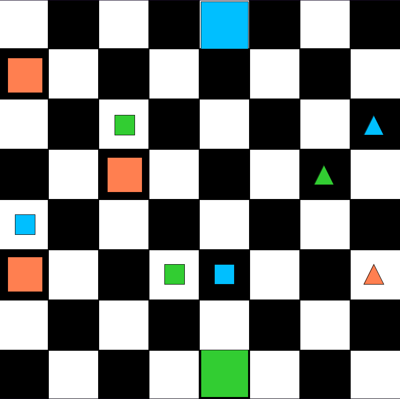

# 37 - Translation

- See `PeirceWorld`:

    

- Translate the following English sentences.
- Again, be sure to check each to see that it is indeed a true sentence
  by running `runQ37` and evaluating them in `PeirceWorld`.

1. Everything is either a square or a triangle.
2. Every square is to the left of every triangle.
3. There are at least three triangles.
4. Every small square is above a particular big square.
5. Every triangle is small and has a different tone than other triangles.
6. Every circle is smaller than some triangle.
  [Note: This is vacuously true in this world.]
7. If a block adjoins another, they are both squares.

- Now let's change the world so that none of the English sentences are true.
- We can do this by changing
  - the two big squares at the top/bottom to circles,
  - one of the two small lime squares to a triangle,
  - and deleting the two small triangles in the far right column.
- If your answers to 1-7 are correct,
  all of your translations should be false as well.
- If not, you have made a mistake in translation.
- Make further changes, and check to see that the truth values
  of your translations track those of the English sentences.
