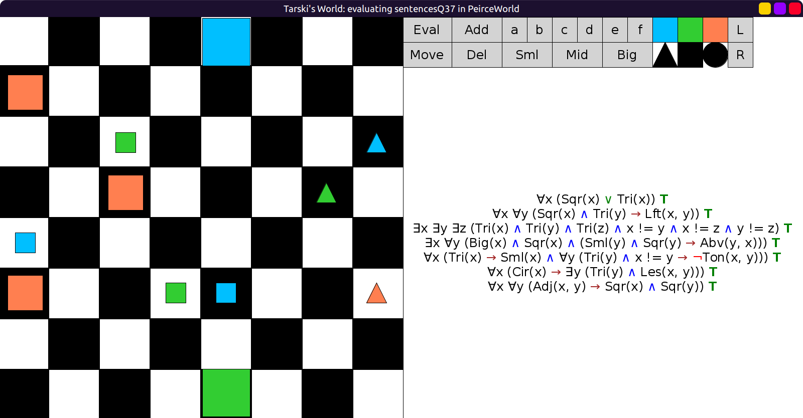
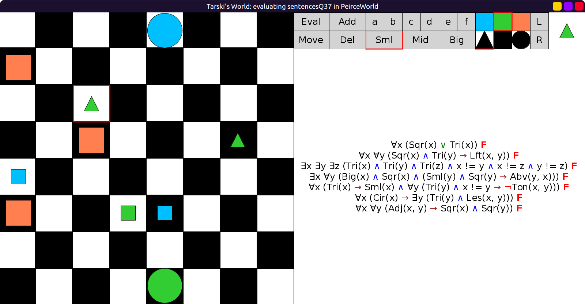

# 37 - solution

```scala
val sentencesQ37 = Seq(
  fof"∀x (Sqr(x) | Tri(x))",                                           // Everything is either a square or a triangle.
  fof"∀x ∀y (Sqr(x) & Tri(y) -> Lft(x, y))",                           // Every square is to the left of every triangle.
  fof"∃x ∃y ∃z (Tri(x) & Tri(y) & Tri(z) & x != y & x != z & y != z)", // There are at least three triangles.
  fof"∃x ∀y (Big(x) & Sqr(x) & (Sml(y) & Sqr(y) -> Abv(y, x)))", // Every small square is above a particular big square.
  fof"∀x (Tri(x) -> Sml(x) & ∀y (Tri(y) & x != y -> ¬Ton(x, y)))", // Every triangle is small and has a different tone than other triangles.
  fof"∀x (Cir(x) -> ∃y (Tri(y) & Les(x, y)))", // Every circle is smaller than some triangle.
  fof"∀x ∀y (Adj(x, y) -> Sqr(x) & Sqr(y))"    // If a block adjoins another, they are both squares.
)
```

Initial evaluation in `PeirceWorld`, all true:



After making the changes, all false:


